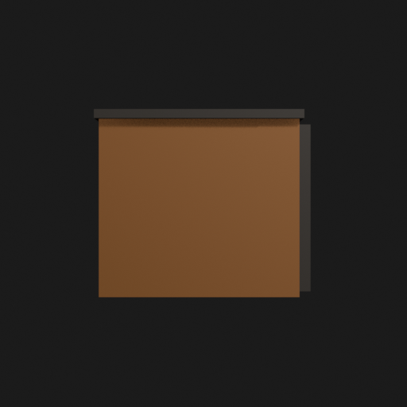
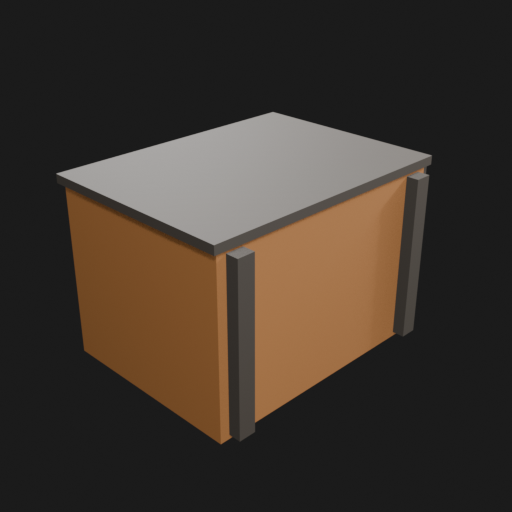
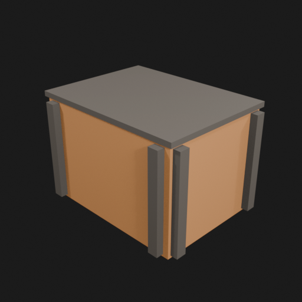
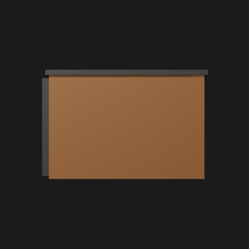

# Asset Forge Job 1 visual review bundle

Canonical Forge job: https://forge.eventinel.com/jobs/2698d389947145e8a775f5385ac66683
Canonical manifest: https://forge.eventinel.com/api/jobs/2698d389947145e8a775f5385ac66683/manifest
Job ID: `2698d389947145e8a775f5385ac66683`
Commit: `bcec8e140aab6477f649155e90038efd7ea1a5ea`

This is an immutable read-only mirror for browser agents whose network policy cannot reach the
custom Forge hostname. It contains the public manifest and the eight public render outputs only.
No bearer key, worker credential, reviewer credential, write URL, or source secret is included.

Views: front, left, perspective_front_left, perspective_front_right, perspective_rear, rear, right, top

## Job 2 comparison

Job 2 is the exact second VM-generated job from the synchronized Actions rerun:

- Job 2 page: https://forge.eventinel.com/jobs/d3af4244021a4eff939ef205fa1eeaa4
- Job 2 manifest: https://forge.eventinel.com/api/jobs/d3af4244021a4eff939ef205fa1eeaa4/manifest
- Job 2 ID: `d3af4244021a4eff939ef205fa1eeaa4`
- Job 2 parent: `2698d389947145e8a775f5385ac66683`
- Job 2 commit: `5ee6a053b05e5d7c343d928027f70dd012cf7232`
- Job 1→Job 2 comparison: https://forge.eventinel.com/api/v1/jobs/2698d389947145e8a775f5385ac66683/compare/d3af4244021a4eff939ef205fa1eeaa4

The `job2/` directory mirrors Job 2's manifest and eight public PNGs. This bridge is a transport
compatibility layer for browser agents; Forge remains the canonical service and source of truth.

## Render gallery

### front

### left

### perspective_front_left

### perspective_front_right

### perspective_rear

### rear

### right

### top

## Job 2 render gallery

### front

### left

### perspective_front_left

### perspective_front_right

### perspective_rear

### rear

### right

### top

