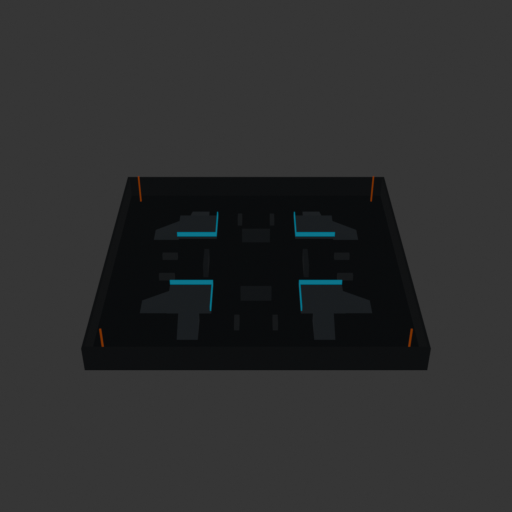
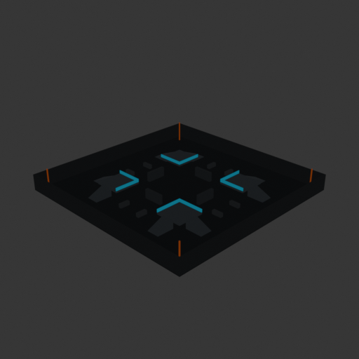
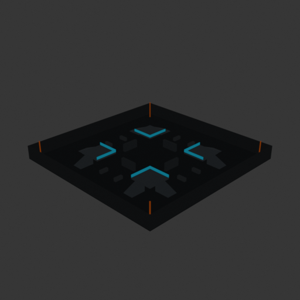
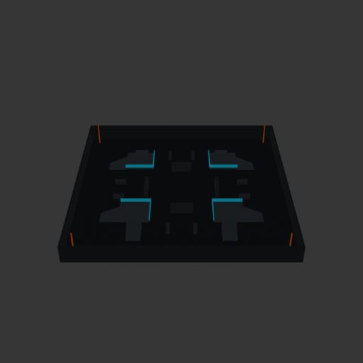
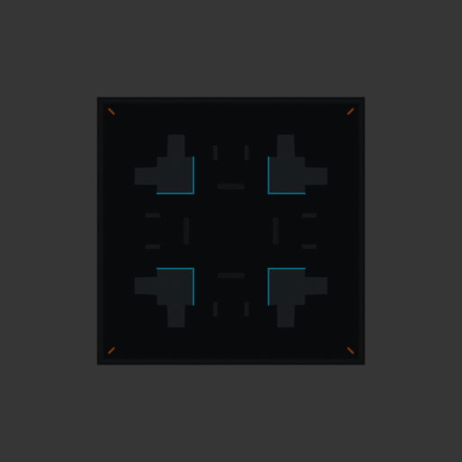

# Asset Forge review: competitive_tag_arena_50x50 / 0d8e52b07b8a4a308ceb5dd68ac496f5

This directory is an immutable, sanitized visual-review bundle generated from a VM Blender job.
It contains no credentials, write endpoints, logs, source archives, or private object-store URLs.

- Job: `0d8e52b07b8a4a308ceb5dd68ac496f5`
- Parent job: `a480be110a3042adbe94979c0e4f3b0d`
- Source commit: `cbc8a12a8eee65b129cd9d3070c42f4d340f5083`
- Blender: `5.1.2`
- Source manifest SHA-256: `3fdd74aaa8e971a200912a31c41bb5783d55b3febb0359a81fbd5530387c7a88`
- Canonical Forge page: https://forge.eventinel.com/jobs/0d8e52b07b8a4a308ceb5dd68ac496f5

## Render gallery

### front

### left

### perspective_front_left

### perspective_front_right

### perspective_rear

### rear

### right

### top

