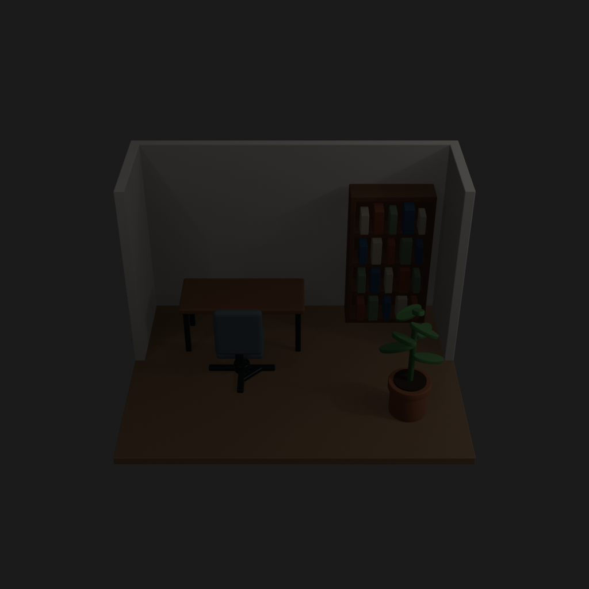
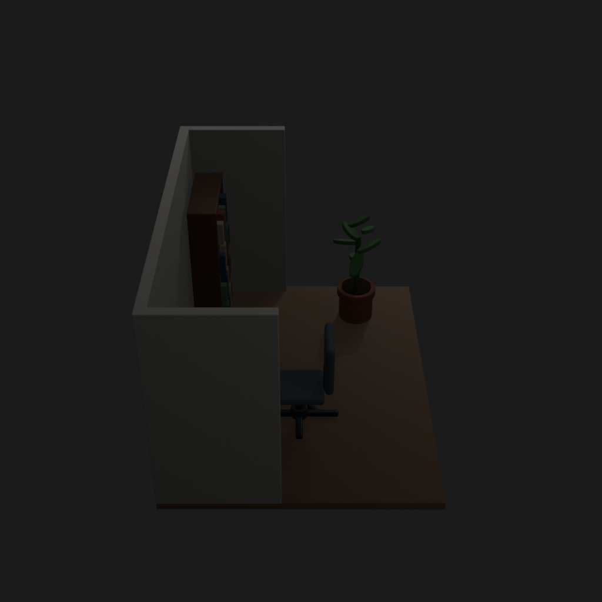
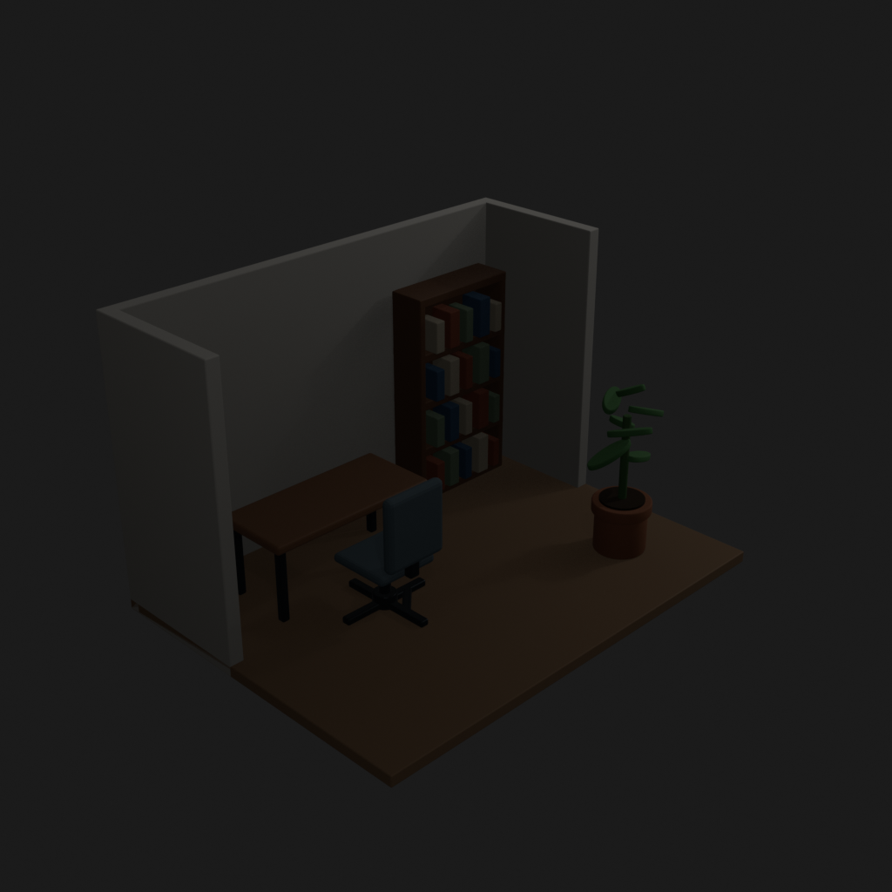
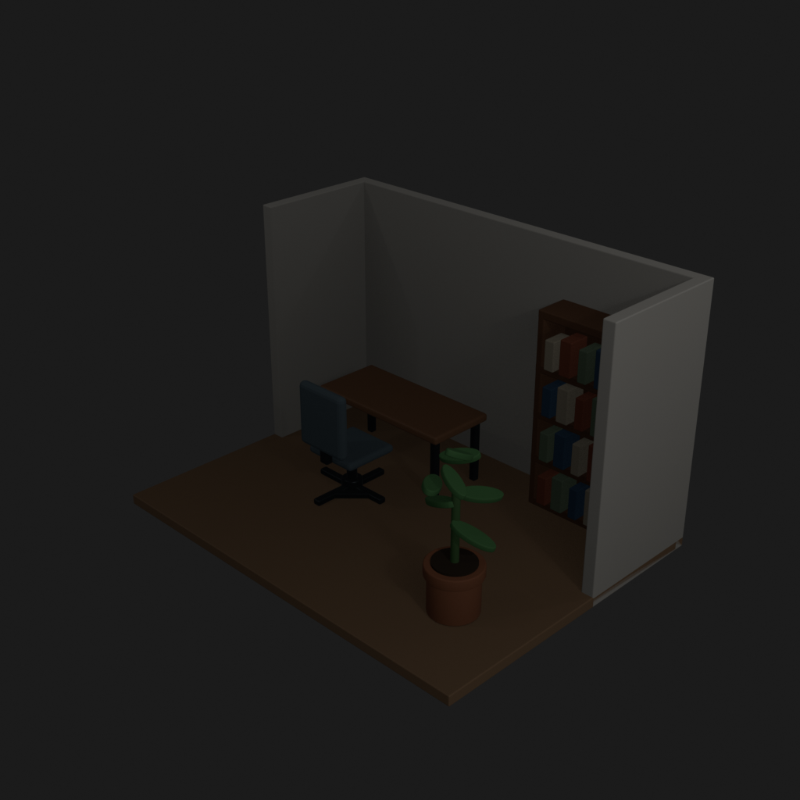
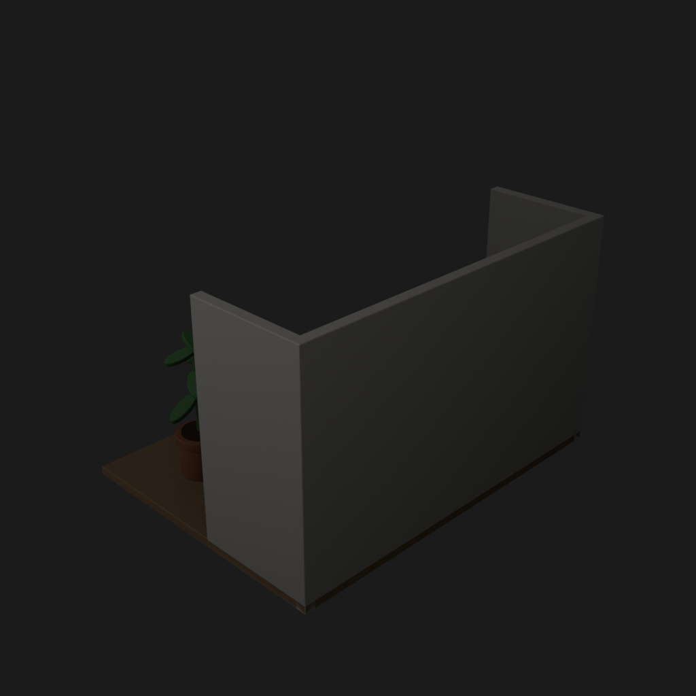
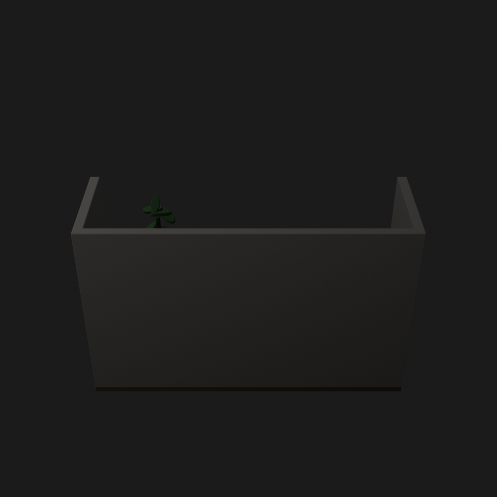
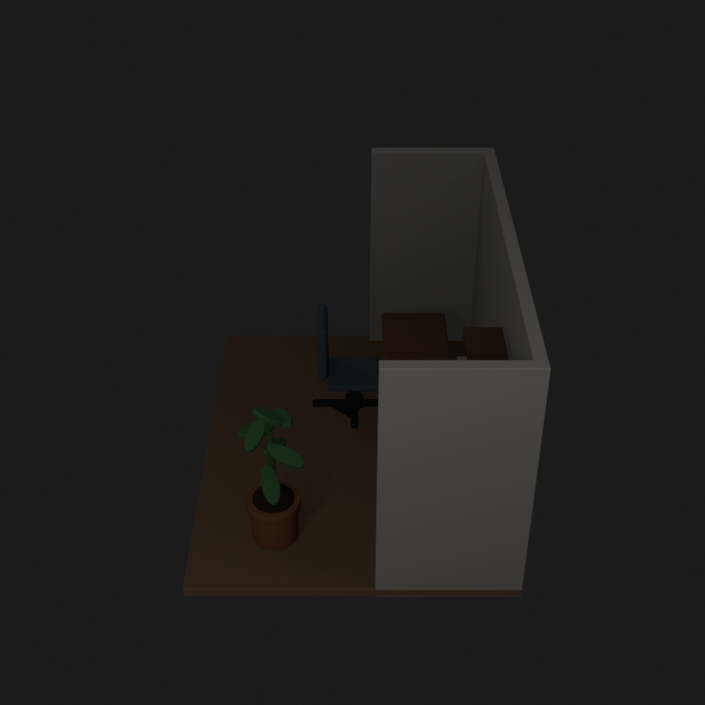
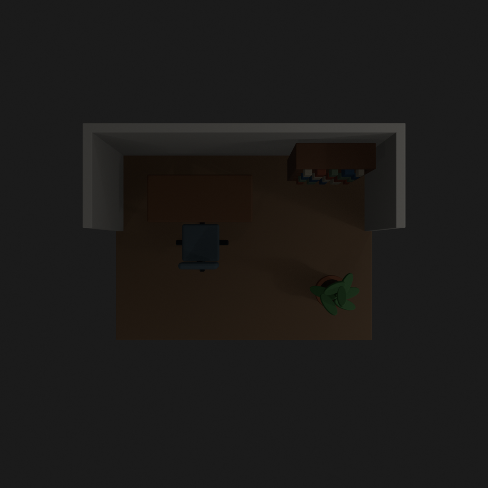

# Asset Forge review: small_office_trial_20260905 / 1fc13cbdb966545595739012431b102e

This directory is an immutable, sanitized visual-review bundle generated from a Blender worker job.
It contains no credentials, write endpoints, logs, source archives, or private object-store URLs.

- Job: `1fc13cbdb966545595739012431b102e`
- Parent job: `none`
- Source commit: `c218eaea6d69ea34cd3a935fb96119e8be593c65`
- Blender: `5.1.2`
- Source manifest SHA-256: `18cfb93c51ece911415efc178278af762e10b80e124fbf85389beb27fffa1bd9`
- Build: https://github.com/MarniBands/BlenderPFZAssets/actions/runs/33980838262

## Render gallery

### front

### left

### perspective_front_left

### perspective_front_right

### perspective_rear

### rear

### right

### top

