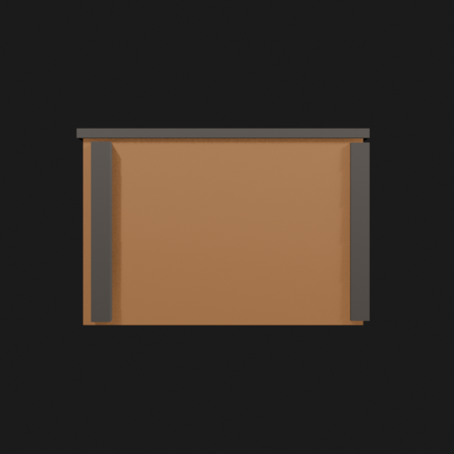
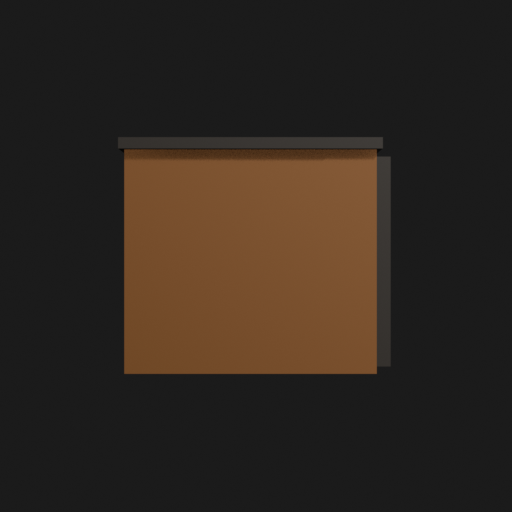
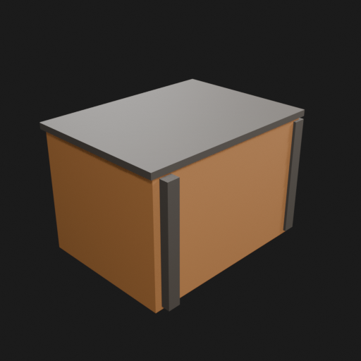
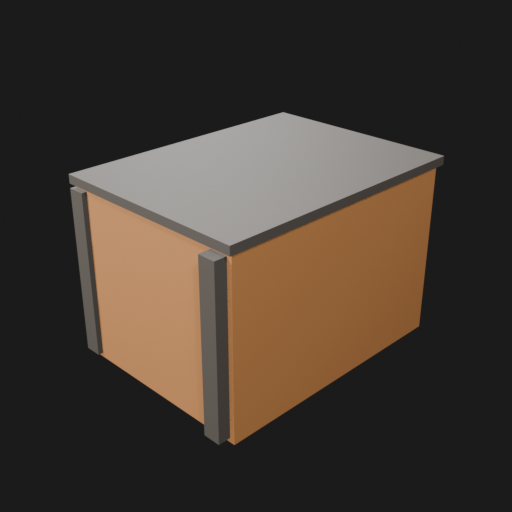
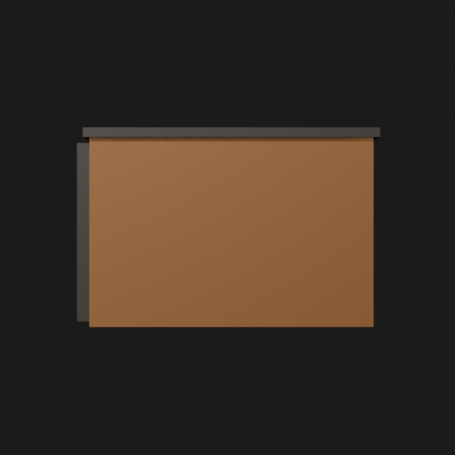
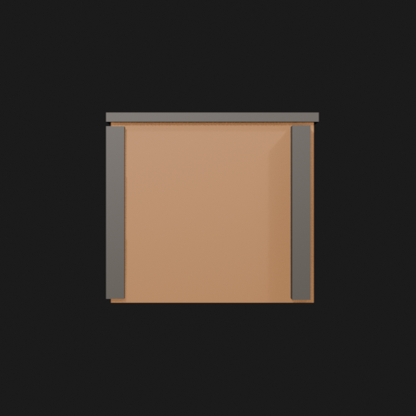

# Asset Forge review: test_crate / 238389120b0a40c68a52438e7bc4ffd9

This directory is an immutable, sanitized visual-review bundle generated from a VM Blender job.
It contains no credentials, write endpoints, logs, source archives, or private object-store URLs.

- Job: `238389120b0a40c68a52438e7bc4ffd9`
- Parent job: `9f010b28ac66414a97dbdcb73a7d5d3e`
- Source commit: `bd4db00b86d19a51c9b1d81e704f47bf0bc51f21`
- Blender: `5.1.2`
- Source manifest SHA-256: `07322cc5841305e8b7764bf971213379ea2f42628a1da236bc550d699a2458e8`
- Canonical Forge page: https://forge.eventinel.com/jobs/238389120b0a40c68a52438e7bc4ffd9

## Render gallery

### front

### left

### perspective_front_left

### perspective_front_right

### perspective_rear

### rear

### right

### top

