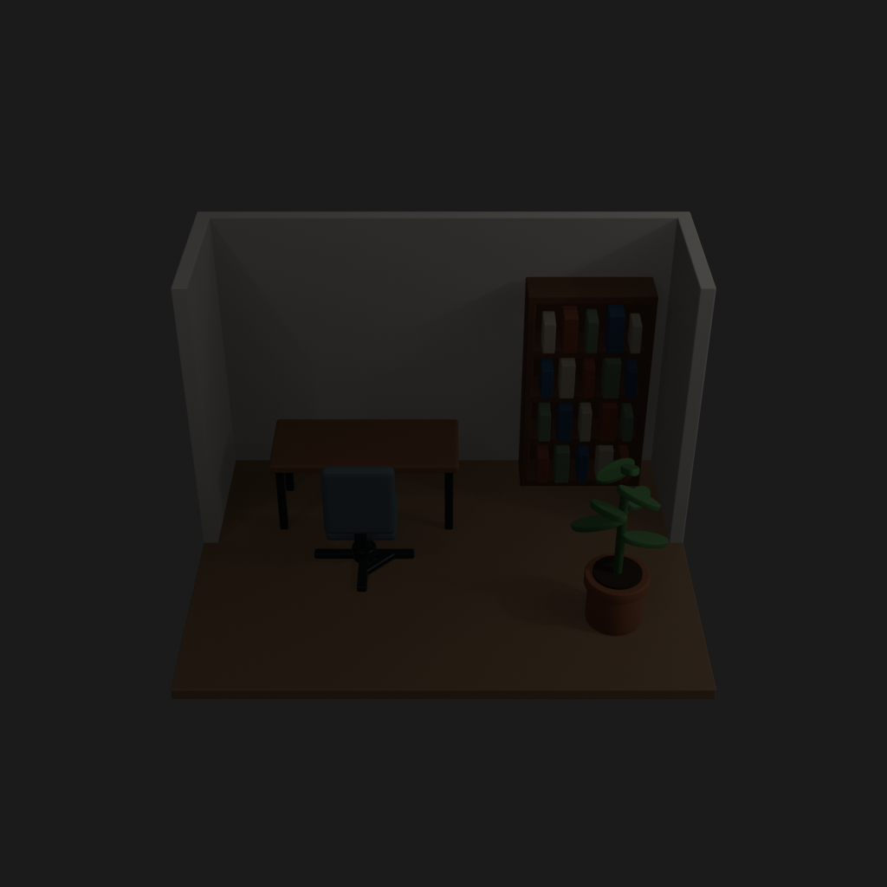
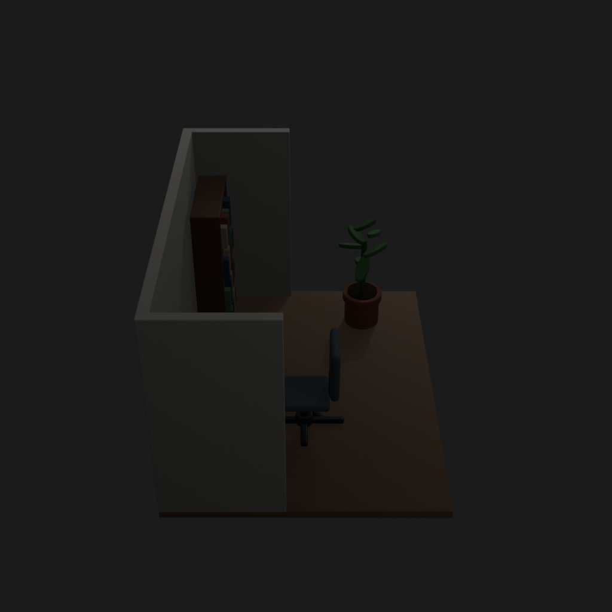
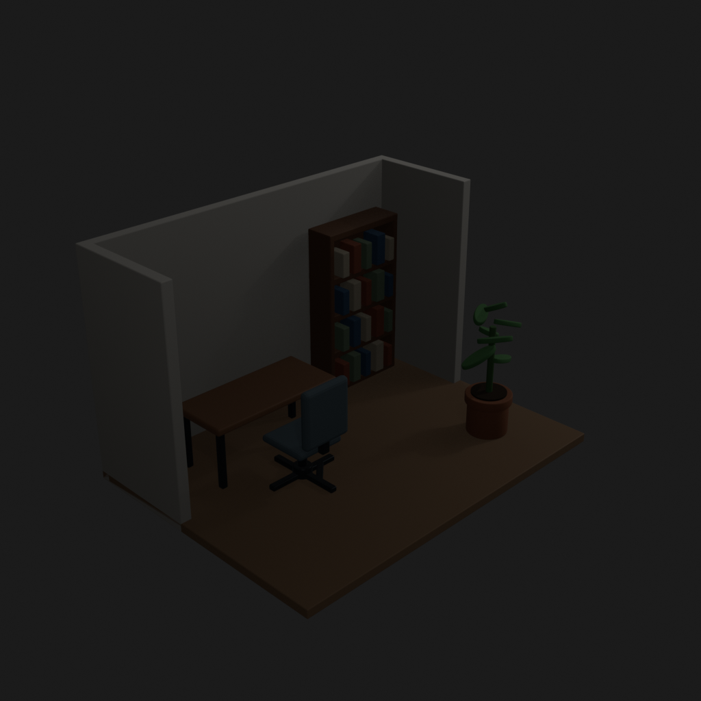
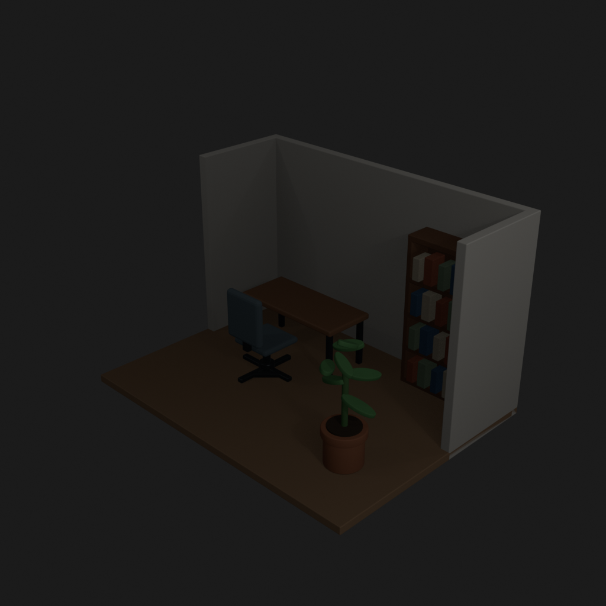
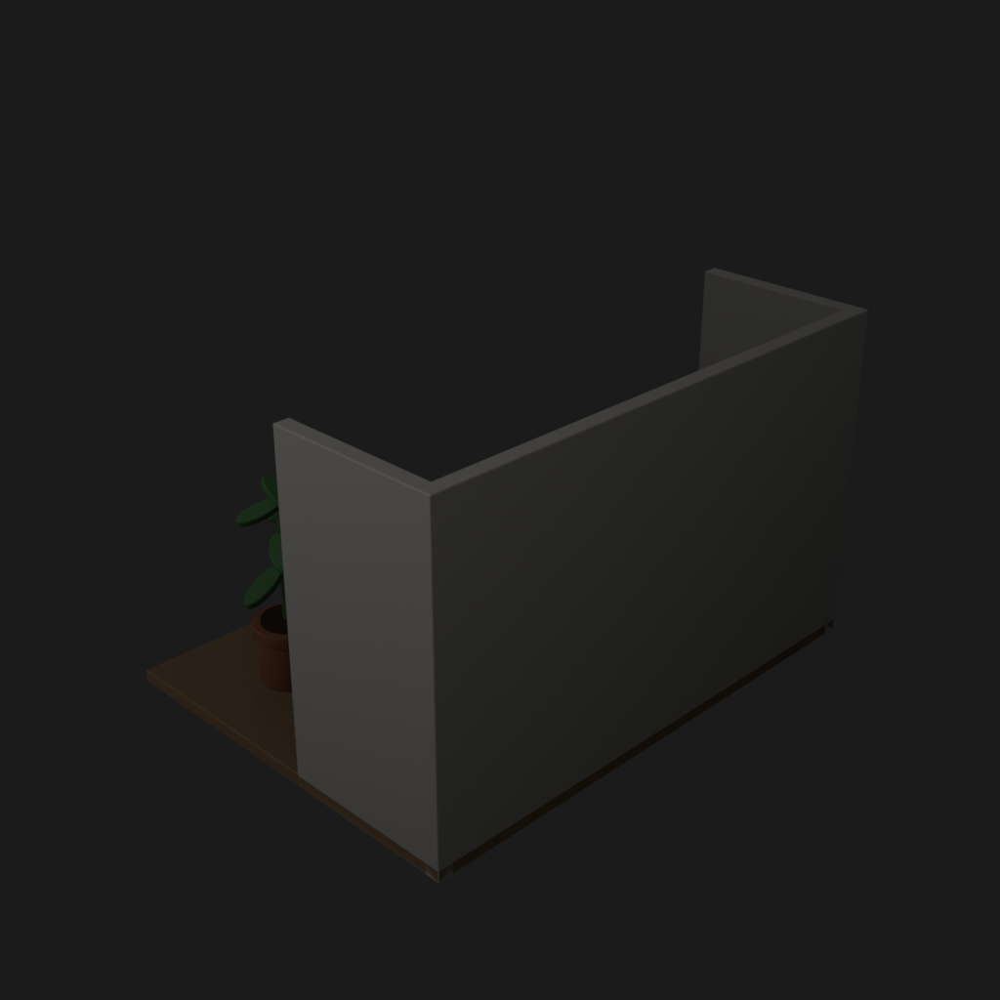
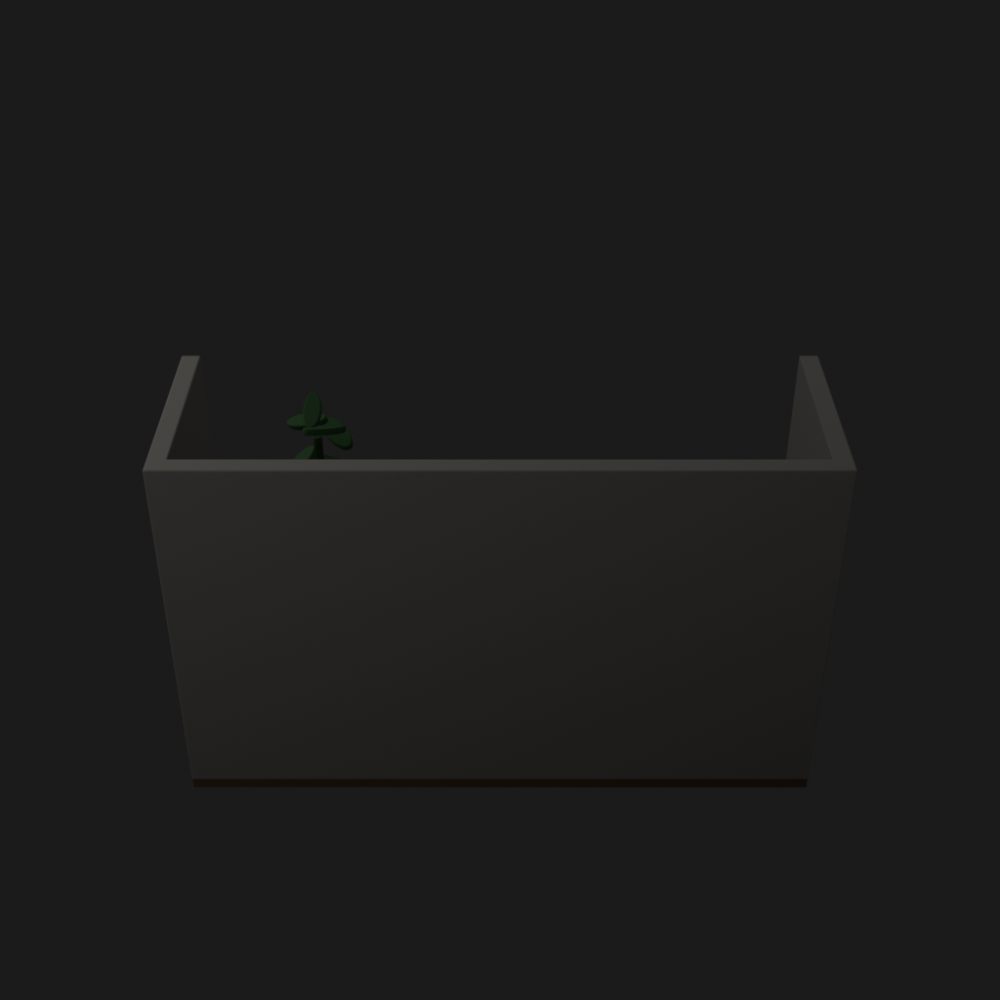
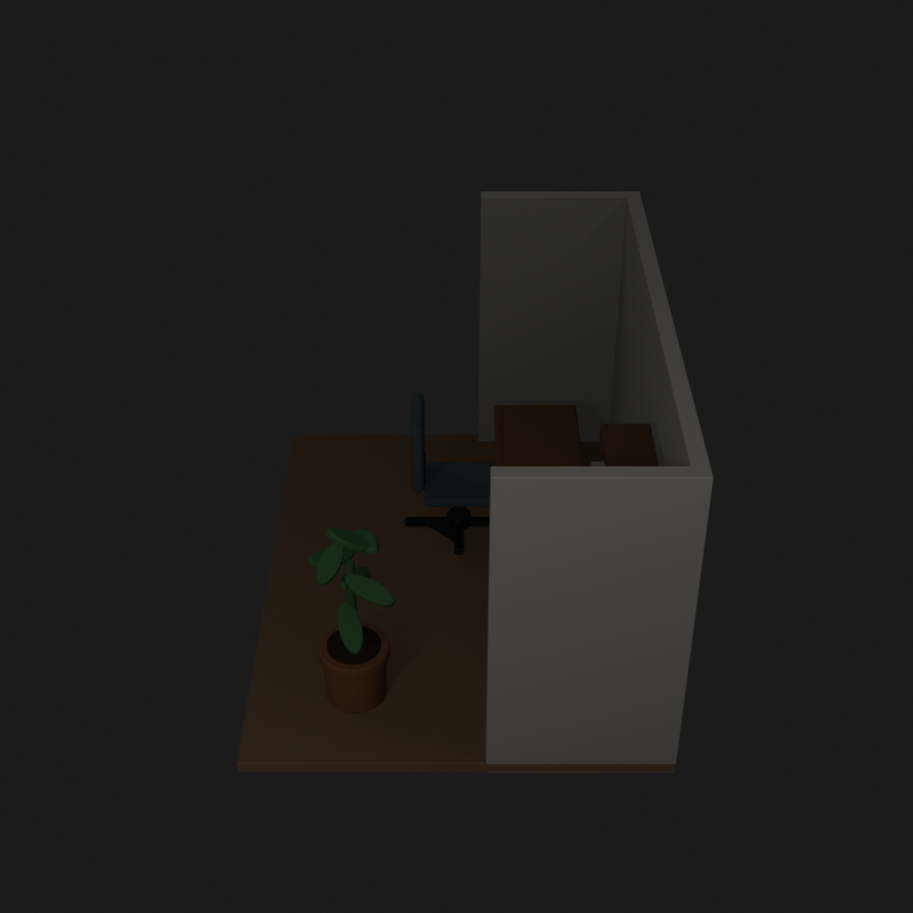
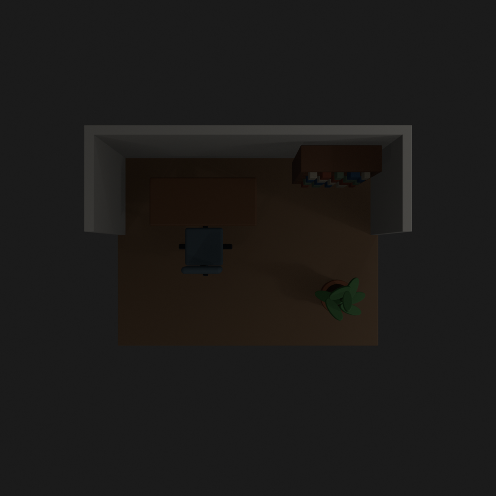

# Asset Forge review: small_office_trial_20260905 / 254cea6d8d8a583bb8f5e4d0b9e614f8

This directory is an immutable, sanitized visual-review bundle generated from a Blender worker job.
It contains no credentials, write endpoints, logs, source archives, or private object-store URLs.

- Job: `254cea6d8d8a583bb8f5e4d0b9e614f8`
- Parent job: `ccb48423443d51e792a4060427baca69`
- Source commit: `a2c9d0a2575b1ded6000b2c886eeecf668e467d1`
- Blender: `5.1.2`
- Source manifest SHA-256: `f82b2de44d4a9595cb0184e39f4c5ccc8ca0707952116f5a1237cb9a37b8ba5d`
- Canonical Forge page: https://forge.eventinel.com/jobs/254cea6d8d8a583bb8f5e4d0b9e614f8

## Render gallery

### front

### left

### perspective_front_left

### perspective_front_right

### perspective_rear

### rear

### right

### top

