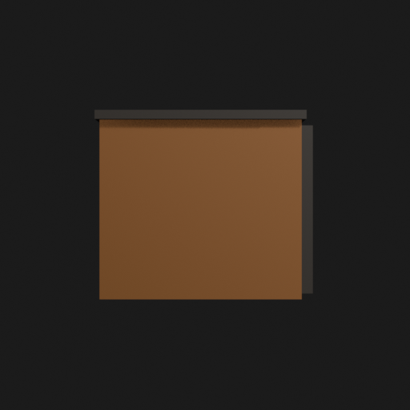
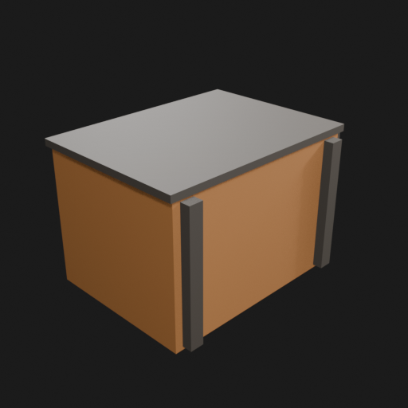
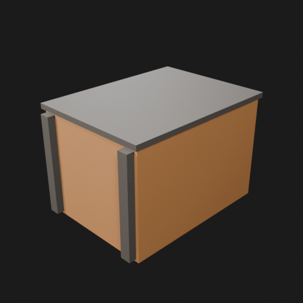

# Asset Forge review: test_crate / 2698d389947145e8a775f5385ac66683

This directory is an immutable, sanitized visual-review bundle generated from a VM Blender job.
It contains no credentials, write endpoints, logs, source archives, or private object-store URLs.

- Job: `2698d389947145e8a775f5385ac66683`
- Parent job: `c48b58449393416aaccc3b01bead5d84`
- Source commit: `bcec8e140aab6477f649155e90038efd7ea1a5ea`
- Blender: `5.1.2`
- Source manifest SHA-256: `860b29ea9d40ff5b83c3427dffe2e509bf13087f8335ac55ee42db22ced277fc`
- Canonical Forge page: https://forge.eventinel.com/jobs/2698d389947145e8a775f5385ac66683

## Render gallery

### front

### left

### perspective_front_left

### perspective_front_right

### perspective_rear

### rear

### right

### top

