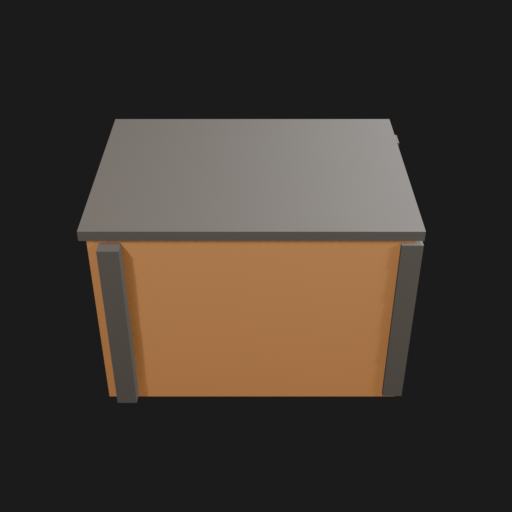
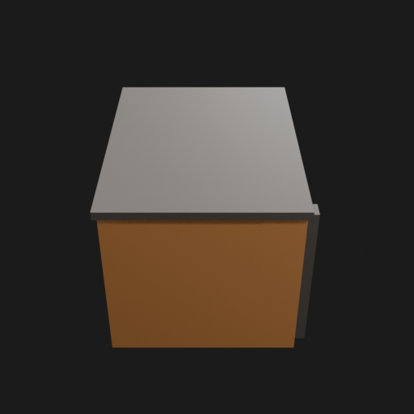
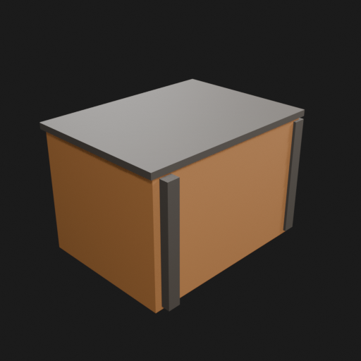
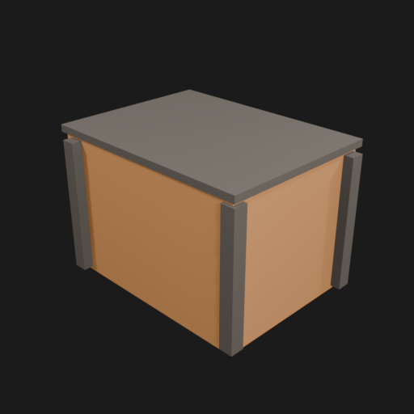
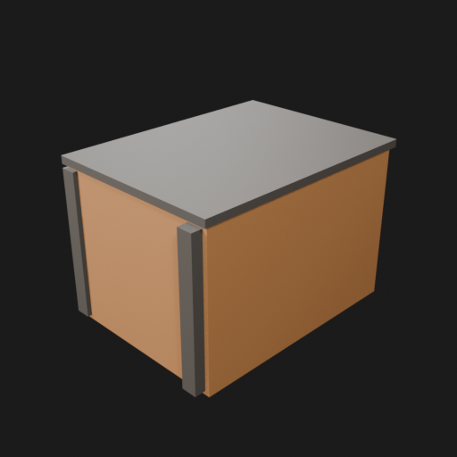
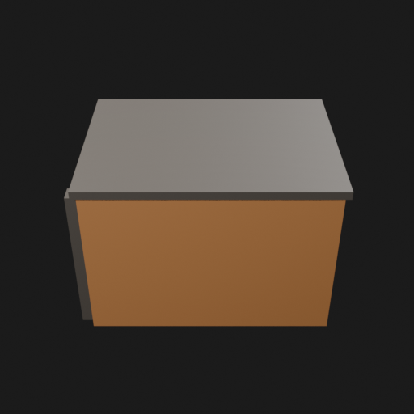
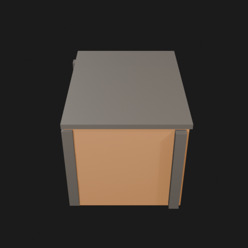

# Asset Forge review: test_crate / 348798f711194b088ee23703c42dbdcc

This directory is an immutable, sanitized visual-review bundle generated from a VM Blender job.
It contains no credentials, write endpoints, logs, source archives, or private object-store URLs.

- Job: `348798f711194b088ee23703c42dbdcc`
- Parent job: `8e521c1b6d1b4158a84991a4c43a01f6`
- Source commit: `5213db7065d80906631a720b9378887dea7e5dfa`
- Blender: `5.1.2`
- Source manifest SHA-256: `3d2c92e6264dc1addd793ff87a2a20cc4f56b101413fca621397fd1bbd6bbdf1`
- Canonical Forge page: https://forge.eventinel.com/jobs/348798f711194b088ee23703c42dbdcc

## Render gallery

### front

### left

### perspective_front_left

### perspective_front_right

### perspective_rear

### rear

### right

### top

