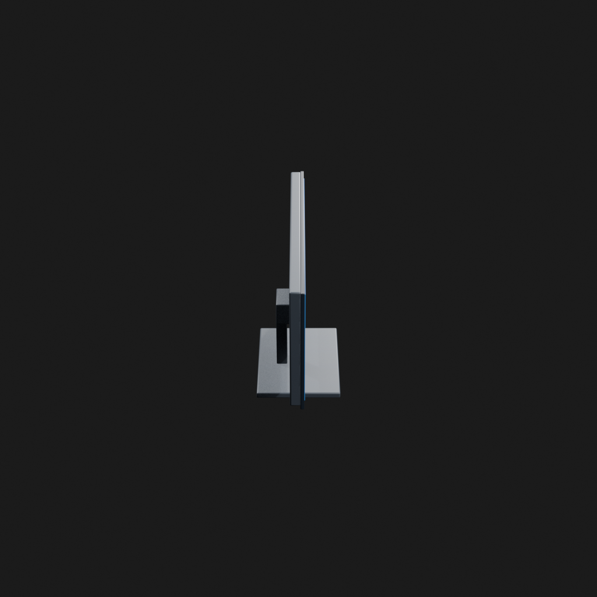
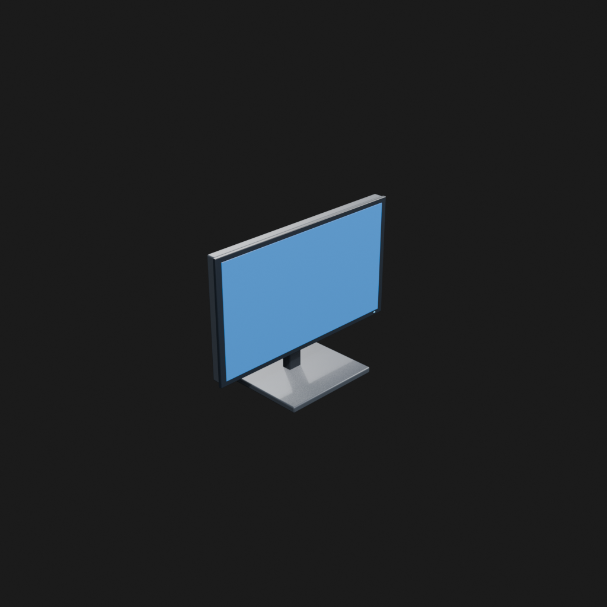
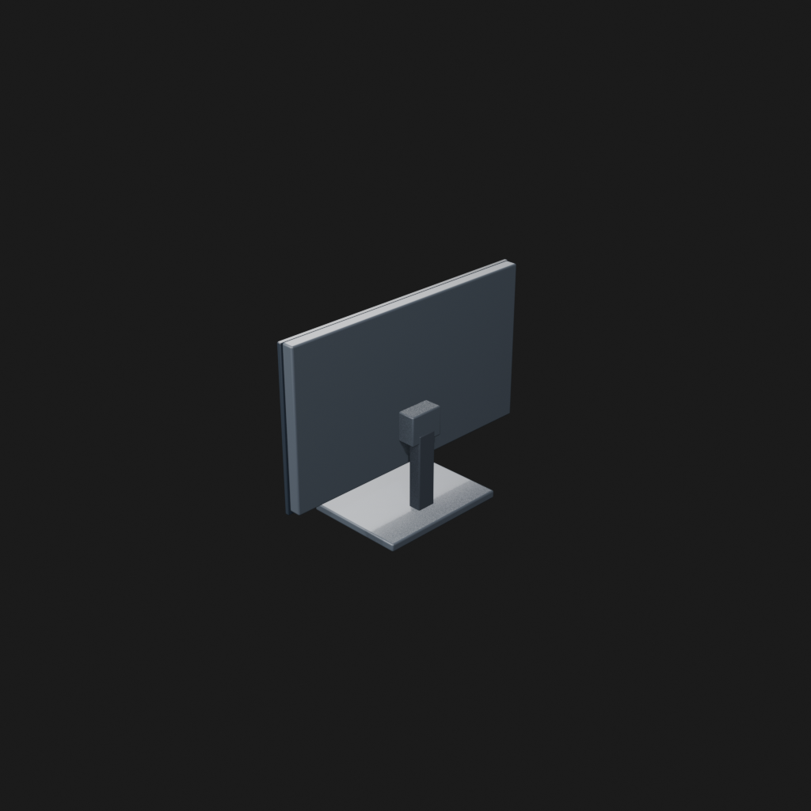
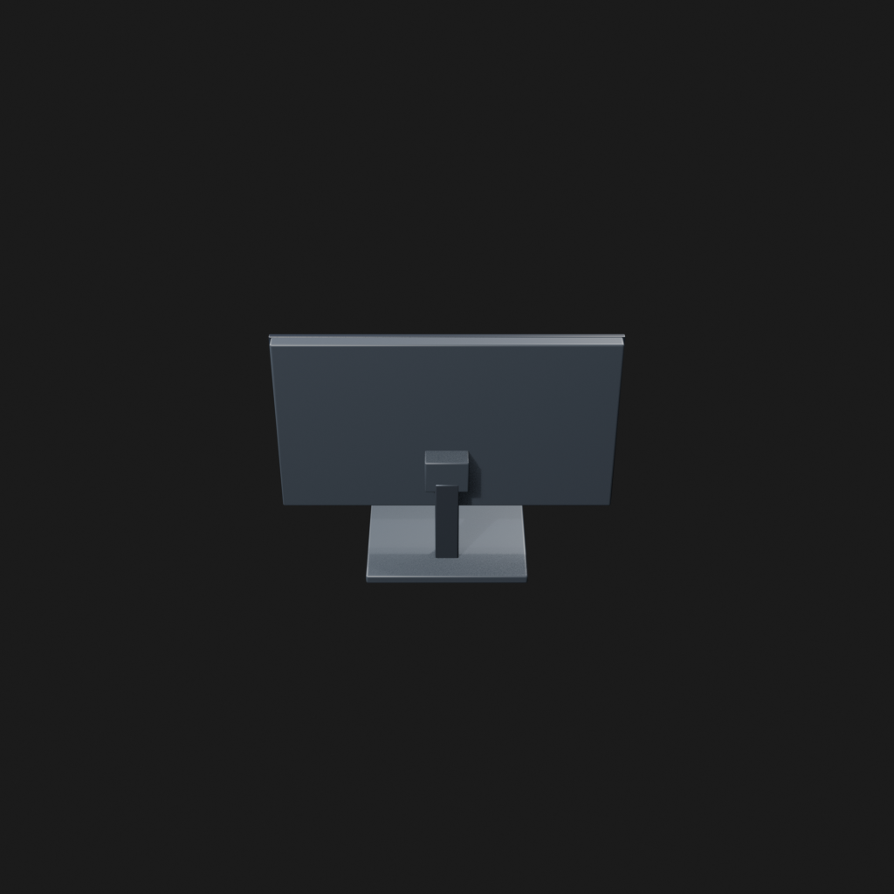
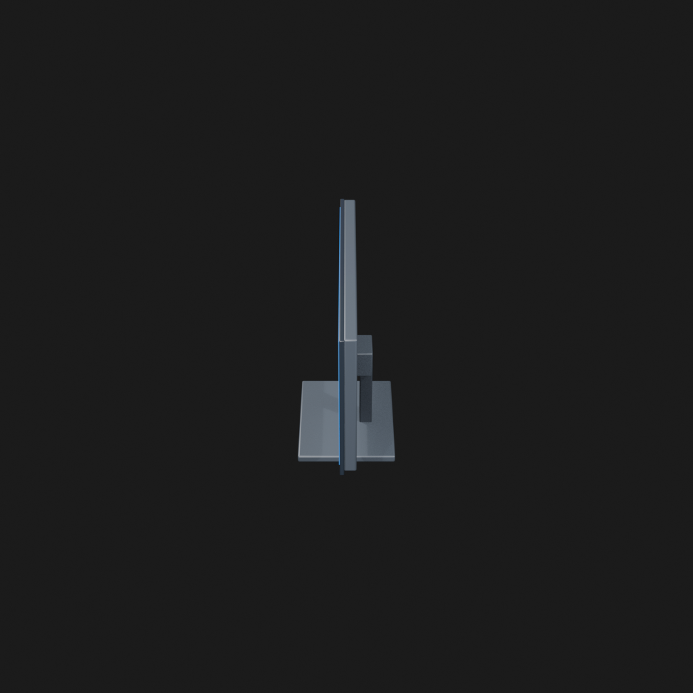
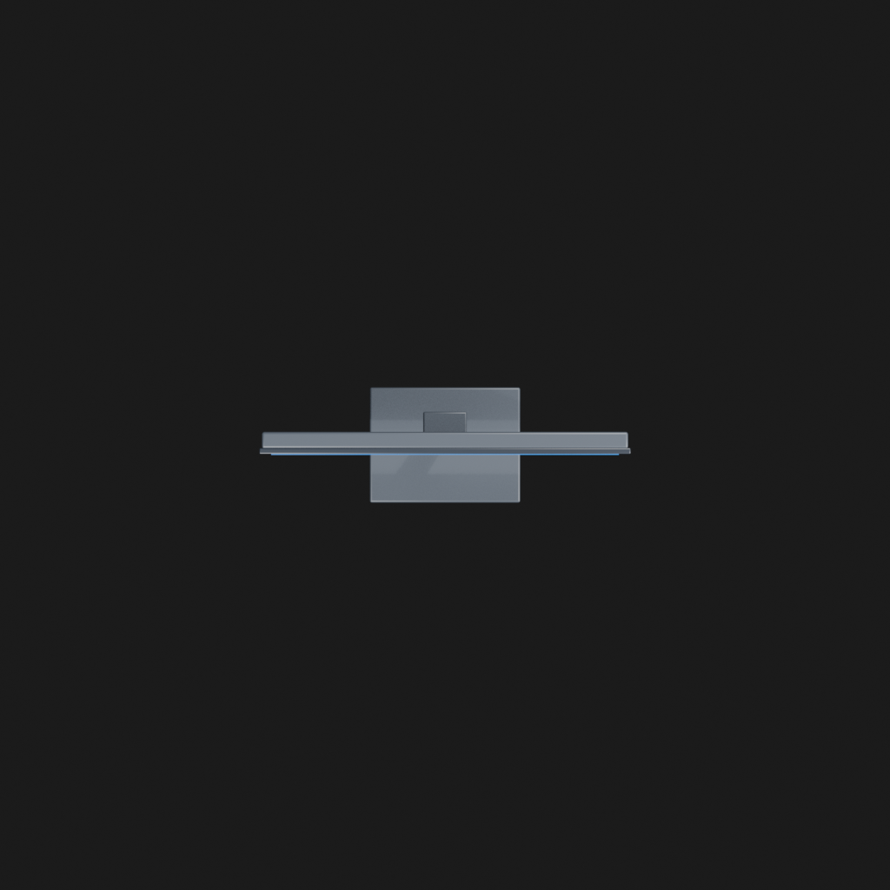

# Asset Forge review: computer_monitor_trial_20260905 / 745e8dfb484f57acbbde7b88e97a86ef

This directory is an immutable, sanitized visual-review bundle generated from a Blender worker job.
It contains no credentials, write endpoints, logs, source archives, or private object-store URLs.

- Job: `745e8dfb484f57acbbde7b88e97a86ef`
- Parent job: `98156756574258d4a75f0867a6b35963`
- Source commit: `dcf6a94351e6009ab87712a549923b000412e442`
- Blender: `5.1.2`
- Source manifest SHA-256: `4e83f22e6937e7dd15a401274f4ae5ef823658dc356f07afdeb1893b2be4174d`
- Canonical Forge page: https://forge.eventinel.com/jobs/745e8dfb484f57acbbde7b88e97a86ef

## Render gallery

### front

### left

### perspective_front_left

### perspective_front_right

### perspective_rear

### rear

### right

### top

