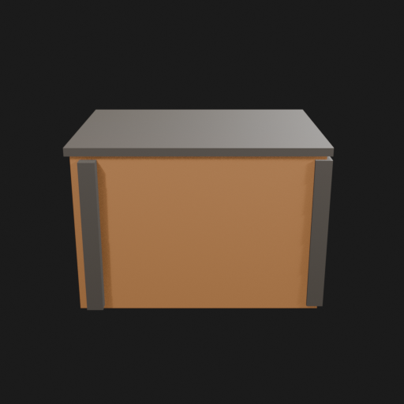
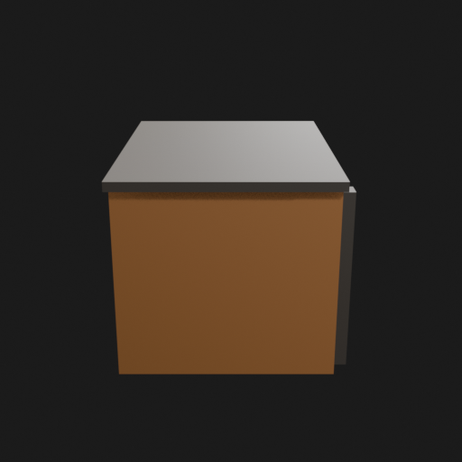
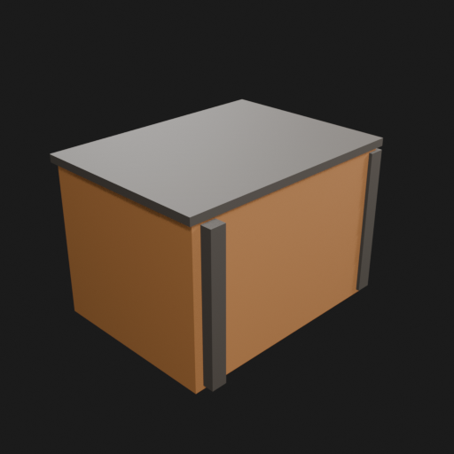
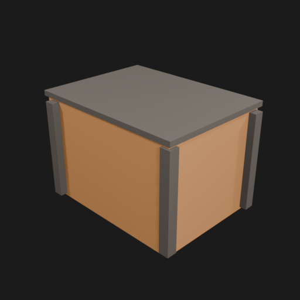
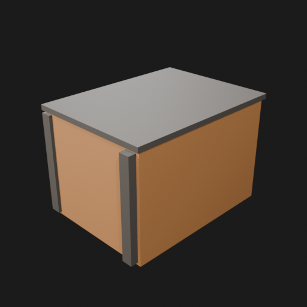
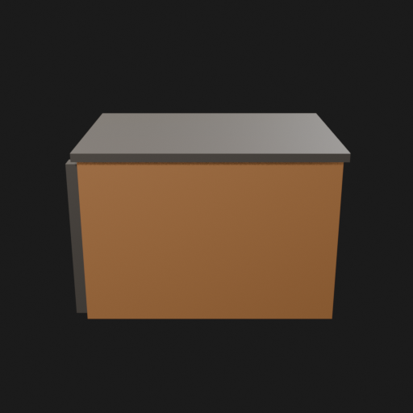
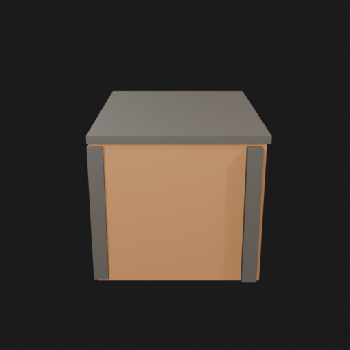

# Asset Forge review: test_crate / 8e521c1b6d1b4158a84991a4c43a01f6

This directory is an immutable, sanitized visual-review bundle generated from a VM Blender job.
It contains no credentials, write endpoints, logs, source archives, or private object-store URLs.

- Job: `8e521c1b6d1b4158a84991a4c43a01f6`
- Parent job: `ec27a545667f42daa7d5395cfb5e4a0b`
- Source commit: `0b085f35f261f200226d1f3c91c36bd11027cbce`
- Blender: `5.1.2`
- Source manifest SHA-256: `3f768e78081395ee47c9813377d4fb18c710421f487763dd50a25c89ddda1ac0`
- Canonical Forge page: https://forge.eventinel.com/jobs/8e521c1b6d1b4158a84991a4c43a01f6

## Render gallery

### front

### left

### perspective_front_left

### perspective_front_right

### perspective_rear

### rear

### right

### top

