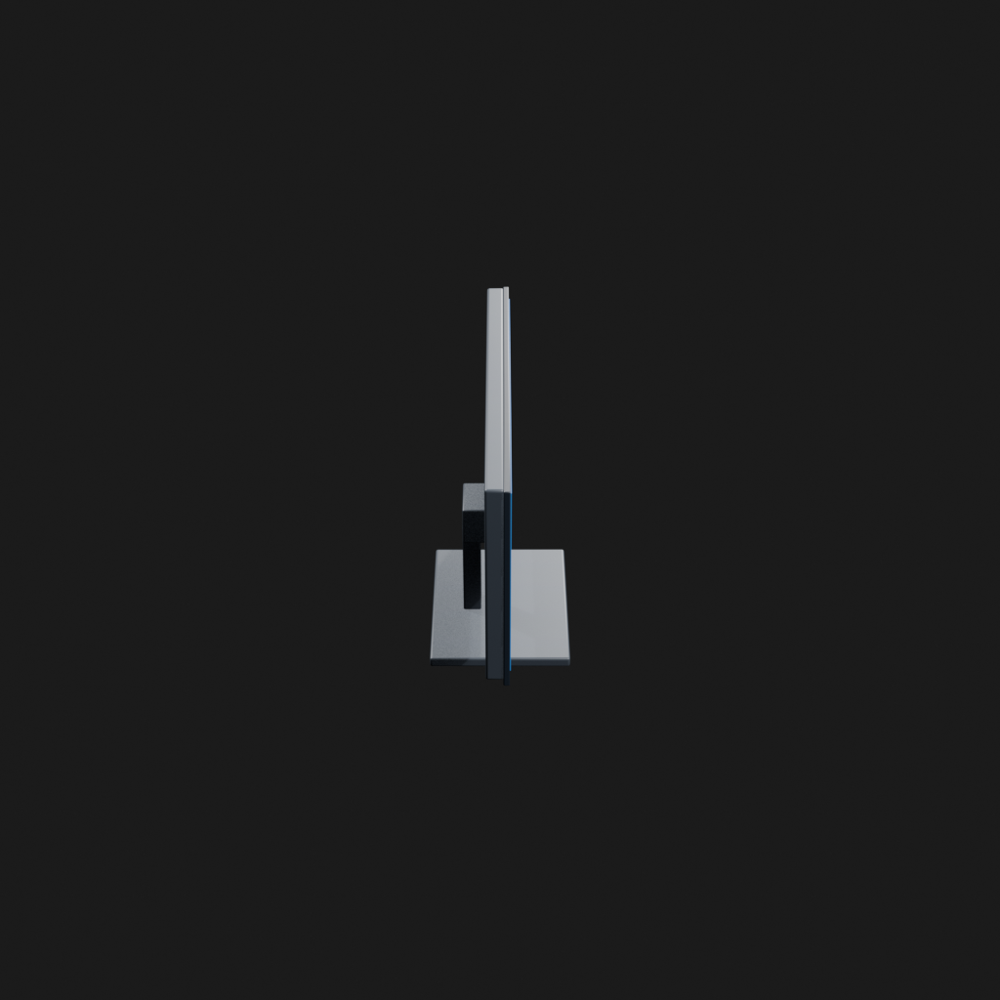
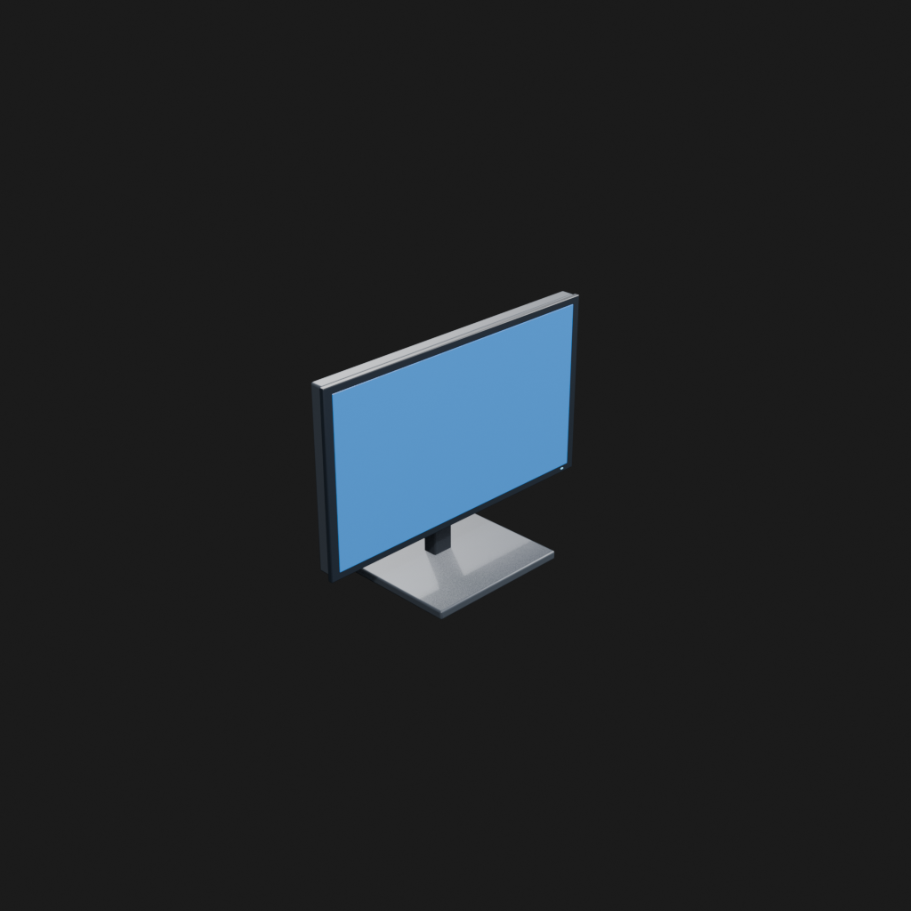
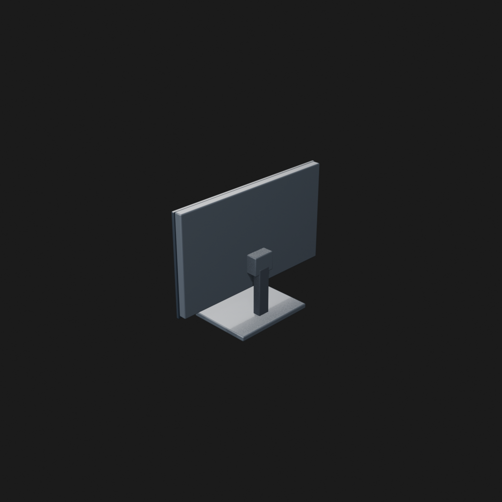
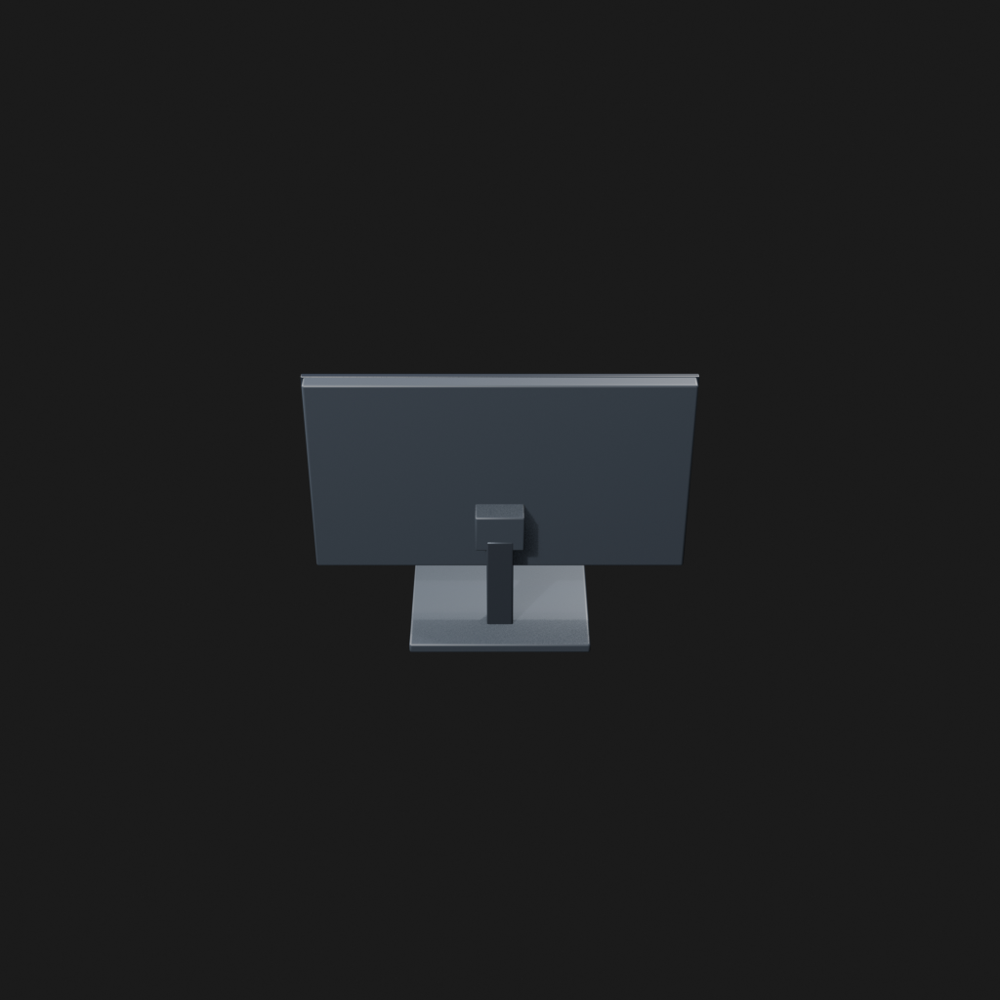
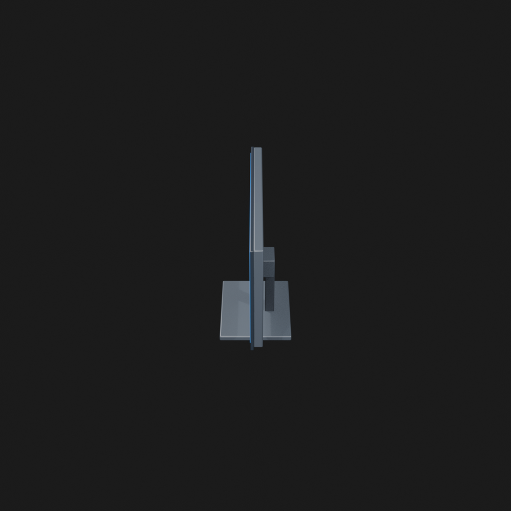
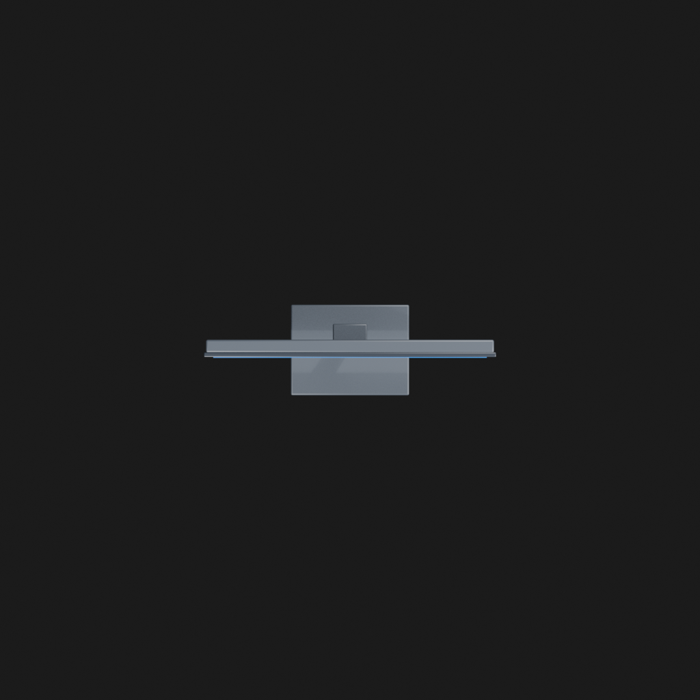

# Asset Forge review: computer_monitor_trial_20260905 / 98156756574258d4a75f0867a6b35963

This directory is an immutable, sanitized visual-review bundle generated from a Blender worker job.
It contains no credentials, write endpoints, logs, source archives, or private object-store URLs.

- Job: `98156756574258d4a75f0867a6b35963`
- Parent job: `none`
- Source commit: `dcf6a94351e6009ab87712a549923b000412e442`
- Blender: `5.1.2`
- Source manifest SHA-256: `4b33cfc709db3d627686f454d7edf8ec606ba697e25665ebcbe38f74f18815cf`
- Canonical Forge page: https://forge.eventinel.com/jobs/98156756574258d4a75f0867a6b35963

## Render gallery

### front

### left

### perspective_front_left

### perspective_front_right

### perspective_rear

### rear

### right

### top

