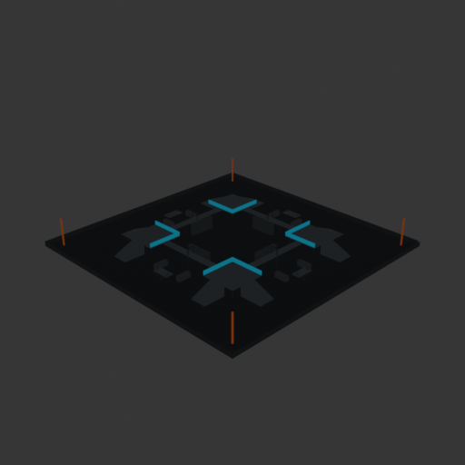
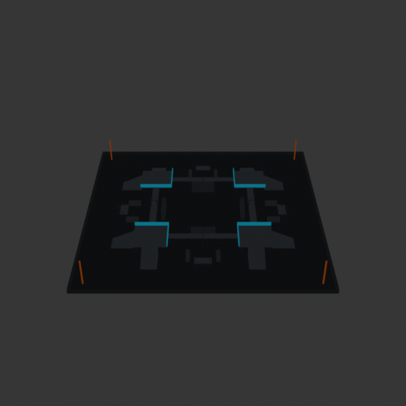

# Asset Forge review: competitive_tag_arena_50x50 / 9c67f545e91a4df085471a4b3090e4ed

This directory is an immutable, sanitized visual-review bundle generated from a VM Blender job.
It contains no credentials, write endpoints, logs, source archives, or private object-store URLs.

- Job: `9c67f545e91a4df085471a4b3090e4ed`
- Parent job: `bc9014439b5a4221ba7cfb5e9c624383`
- Source commit: `ac06b7f79951232d05029023258a918dba3929f2`
- Blender: `5.1.2`
- Source manifest SHA-256: `0cae6a1e07715b465fcad4dad9c523ab33e054af2576aa951246a60973325fe5`
- Canonical Forge page: https://forge.eventinel.com/jobs/9c67f545e91a4df085471a4b3090e4ed

## Render gallery

### front

### left

### perspective_front_left

### perspective_front_right

### perspective_rear

### rear

### right

### top

