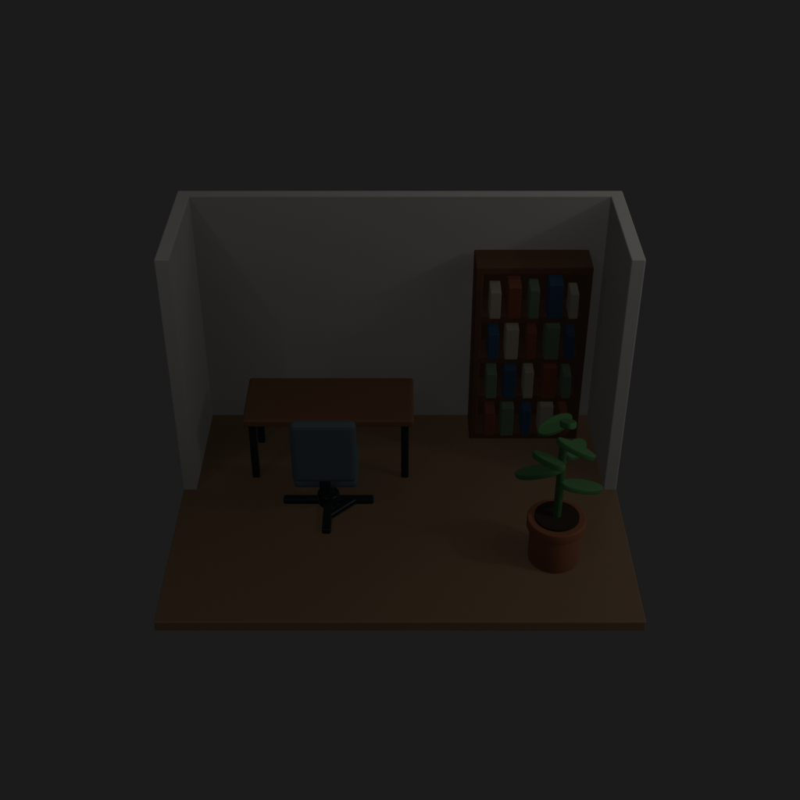
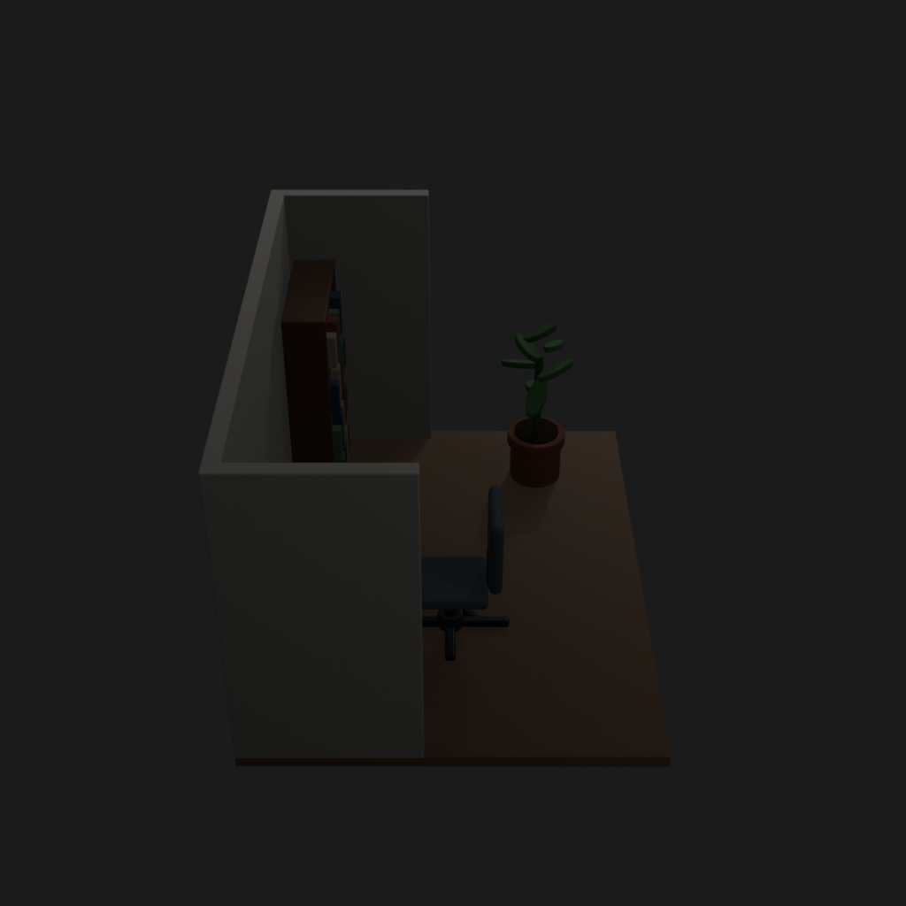
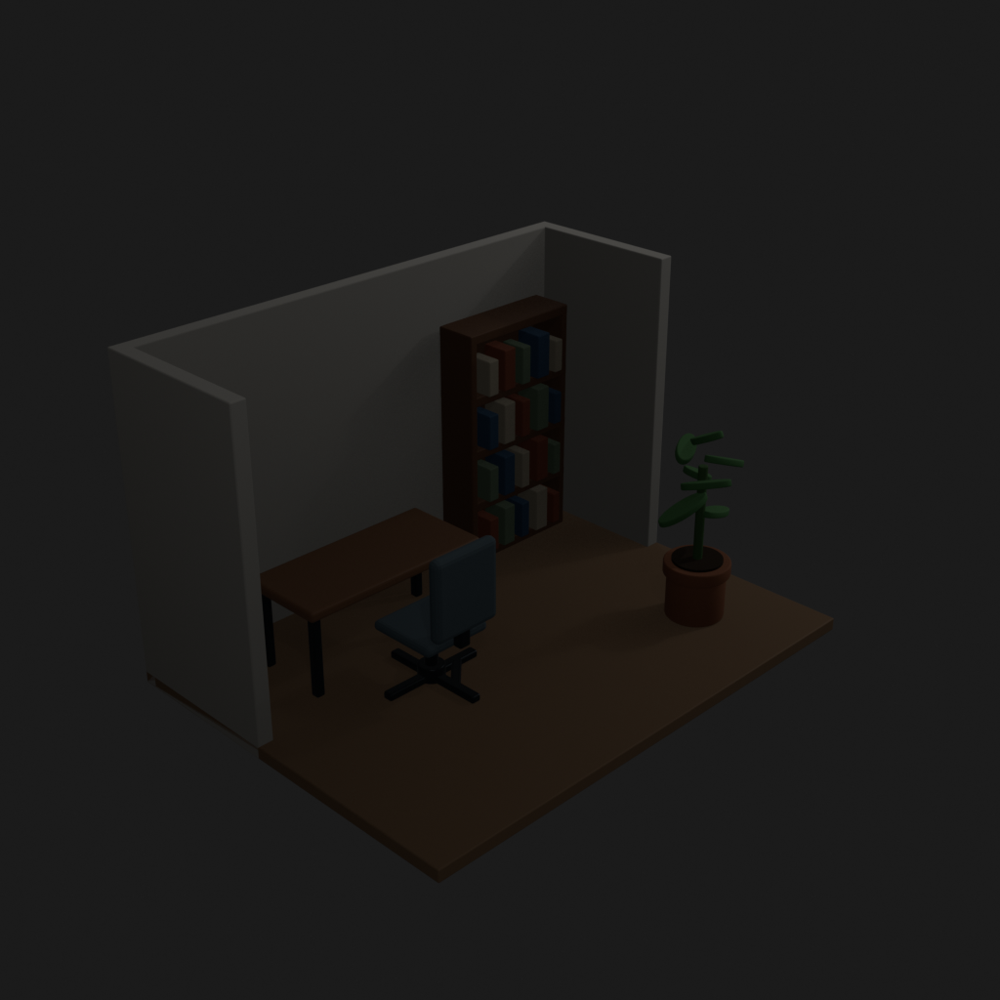
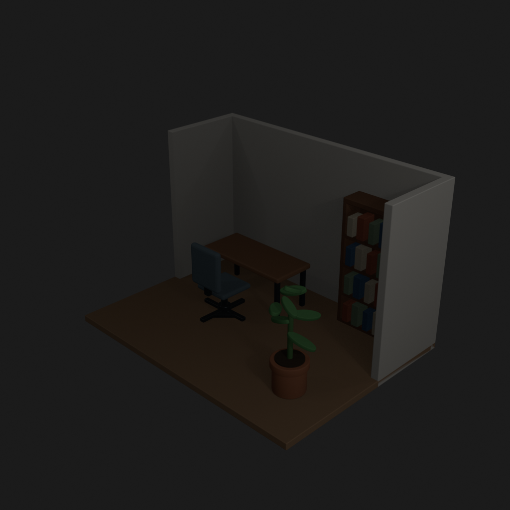
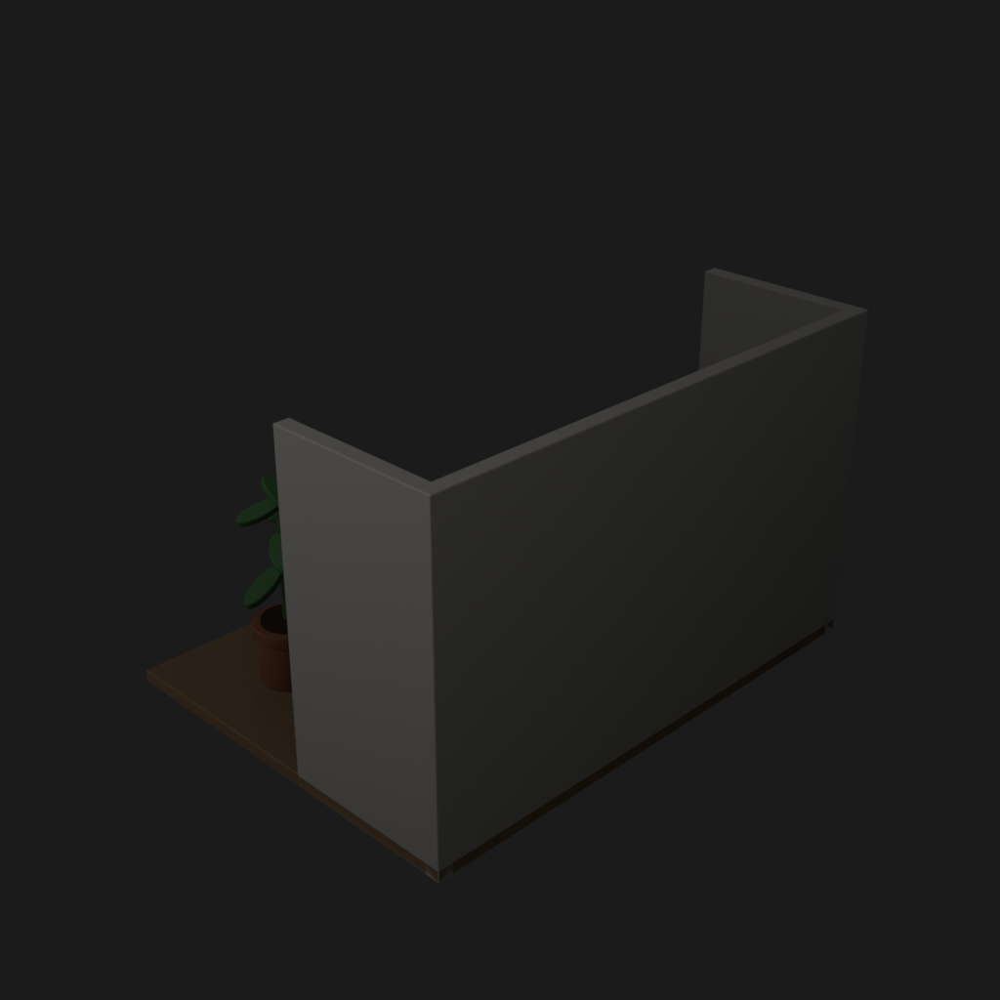
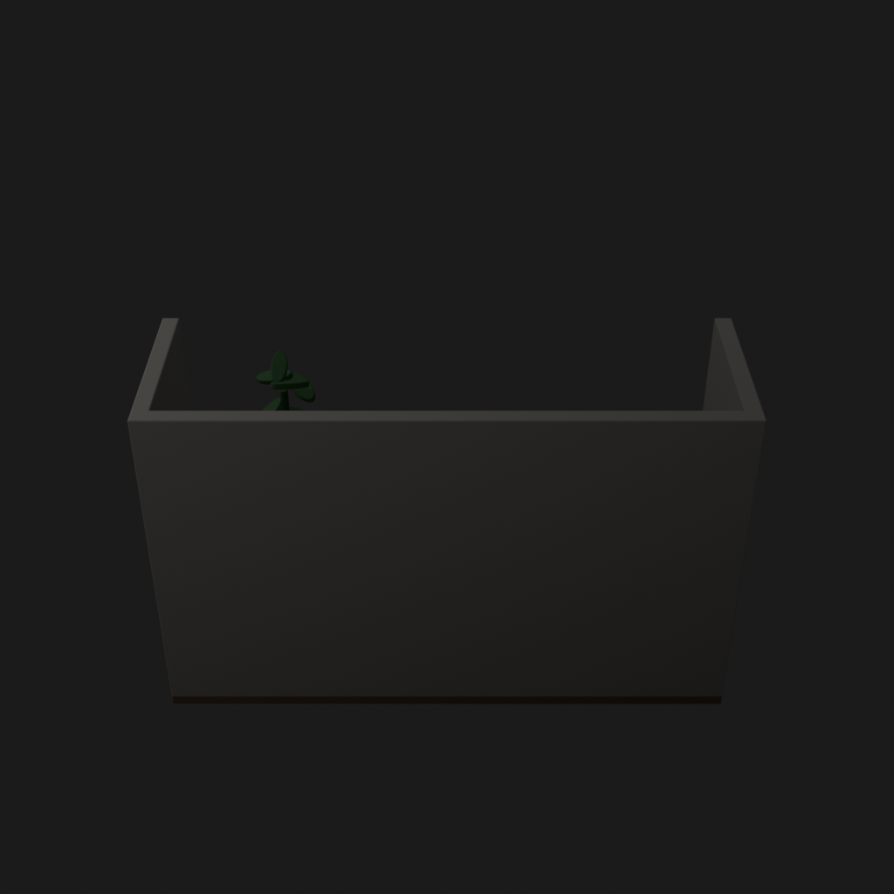
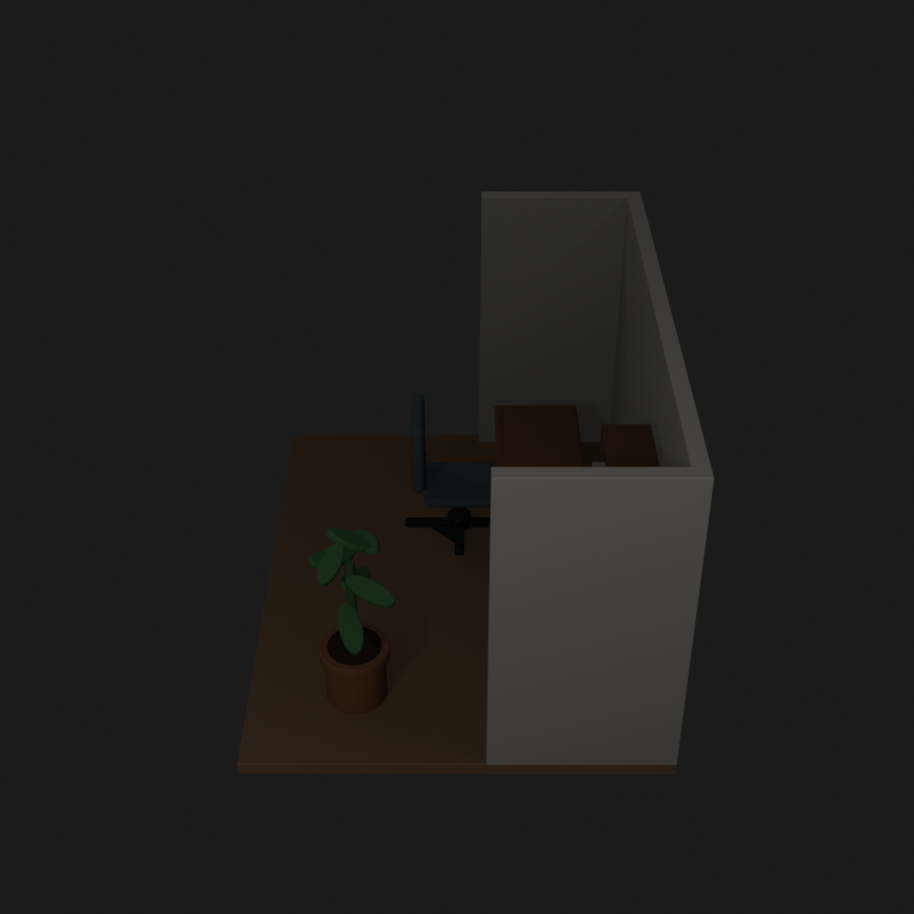
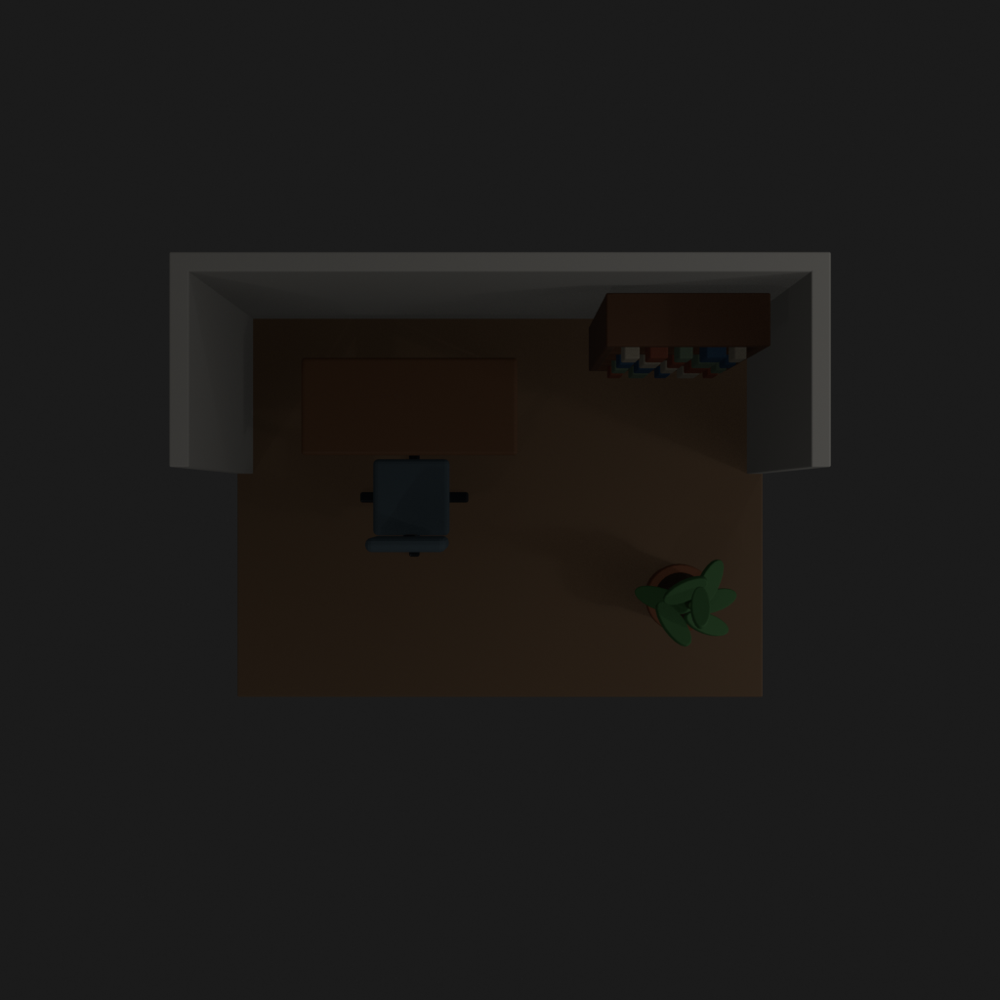

# Asset Forge review: small_office_trial_20260905 / 9ef49db5de7758bd8352677225cf1ea9

This directory is an immutable, sanitized visual-review bundle generated from a Blender worker job.
It contains no credentials, write endpoints, logs, source archives, or private object-store URLs.

- Job: `9ef49db5de7758bd8352677225cf1ea9`
- Parent job: `none`
- Source commit: `cbcbb2002397d46a3ff3b70767006057c2398900`
- Blender: `5.1.2`
- Source manifest SHA-256: `26da750536e3d486a631e6428e9cca377ae8e5bda4e82a44747c5e4da8530e46`
- Build: https://github.com/MarniBands/BlenderPFZAssets/actions/runs/33984868360

## Render gallery

### front

### left

### perspective_front_left

### perspective_front_right

### perspective_rear

### rear

### right

### top

