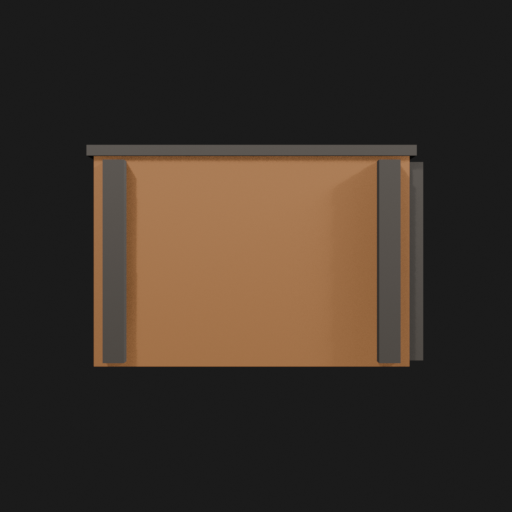
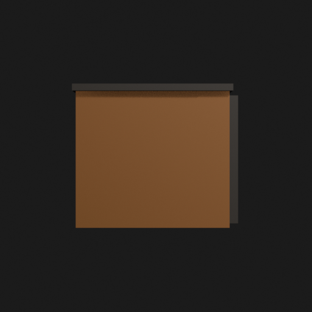
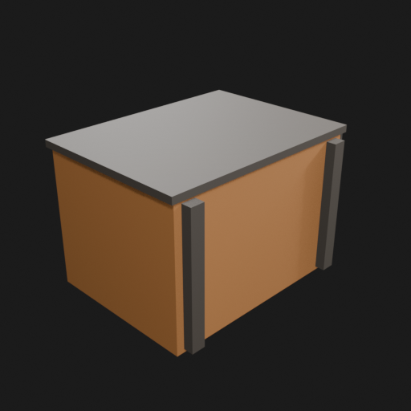
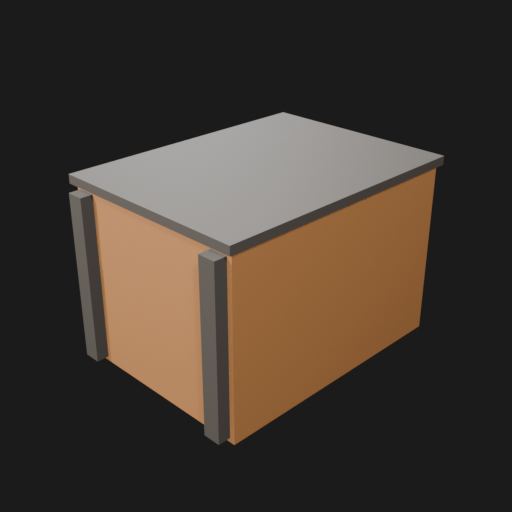
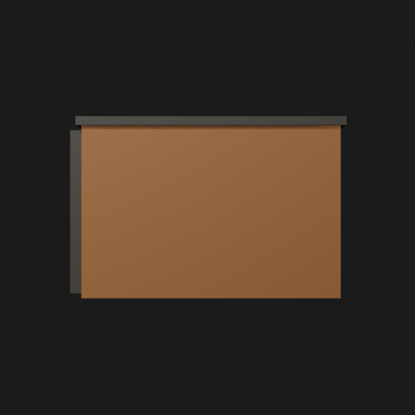
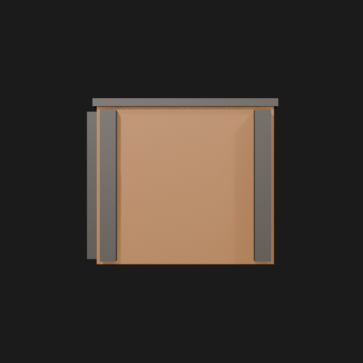

# Asset Forge review: test_crate / 9f010b28ac66414a97dbdcb73a7d5d3e

This directory is an immutable, sanitized visual-review bundle generated from a VM Blender job.
It contains no credentials, write endpoints, logs, source archives, or private object-store URLs.

- Job: `9f010b28ac66414a97dbdcb73a7d5d3e`
- Parent job: `d3af4244021a4eff939ef205fa1eeaa4`
- Source commit: `7aa26991f343ba3731a80d93bb8262b290bf7913`
- Blender: `5.1.2`
- Source manifest SHA-256: `d5166a85de119f811c15b6c7776cf36b8fbd89de3de37559f79078dfe3cfd529`
- Canonical Forge page: https://forge.eventinel.com/jobs/9f010b28ac66414a97dbdcb73a7d5d3e

## Render gallery

### front

### left

### perspective_front_left

### perspective_front_right

### perspective_rear

### rear

### right

### top

