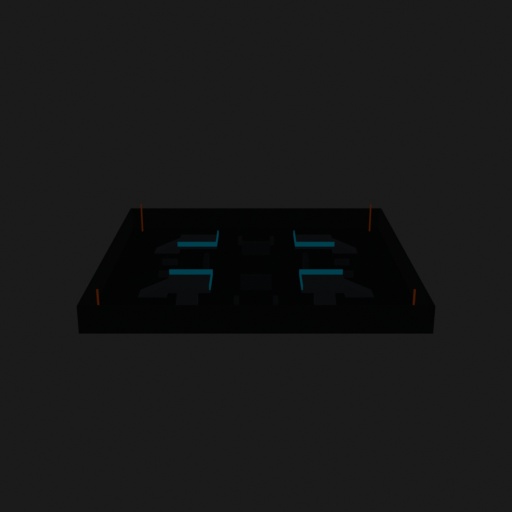
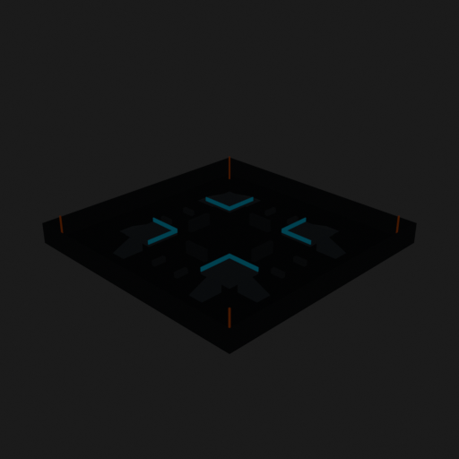
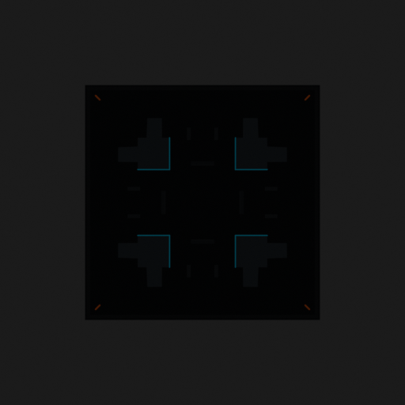

# Asset Forge review: competitive_tag_arena_50x50 / a480be110a3042adbe94979c0e4f3b0d

This directory is an immutable, sanitized visual-review bundle generated from a VM Blender job.
It contains no credentials, write endpoints, logs, source archives, or private object-store URLs.

- Job: `a480be110a3042adbe94979c0e4f3b0d`
- Parent job: `d086649a727246559e5812b197f5bba6`
- Source commit: `0b085f35f261f200226d1f3c91c36bd11027cbce`
- Blender: `5.1.2`
- Source manifest SHA-256: `83f044d6509371fb18a7dcf7e55cca5f5833ca07ffd20b47abb4fde4cf137bf7`
- Canonical Forge page: https://forge.eventinel.com/jobs/a480be110a3042adbe94979c0e4f3b0d

## Render gallery

### front

### left

### perspective_front_left

### perspective_front_right

### perspective_rear

### rear

### right

### top

