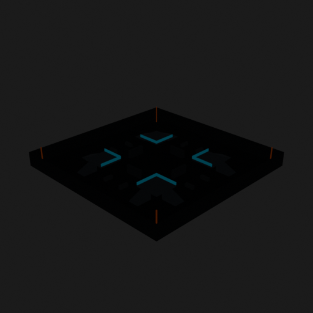
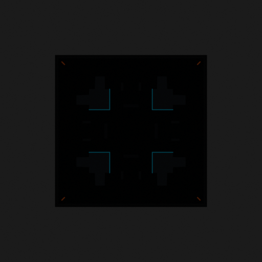

# Asset Forge review: competitive_tag_arena_50x50 / b1de79b407f64b6380aba6d1abb2ab2f

This directory is an immutable, sanitized visual-review bundle generated from a VM Blender job.
It contains no credentials, write endpoints, logs, source archives, or private object-store URLs.

- Job: `b1de79b407f64b6380aba6d1abb2ab2f`
- Parent job: `none`
- Source commit: `add832ba270ec941e224f5202f5b3c35327980e7`
- Blender: `5.1.2`
- Source manifest SHA-256: `7f7ab5ab2a3b674259584d95753b7bcb62f1ced28561106b4532634151e3175a`
- Canonical Forge page: https://forge.eventinel.com/jobs/b1de79b407f64b6380aba6d1abb2ab2f

## Render gallery

### front

### left

### perspective_front_left

### perspective_front_right

### perspective_rear

### rear

### right

### top

