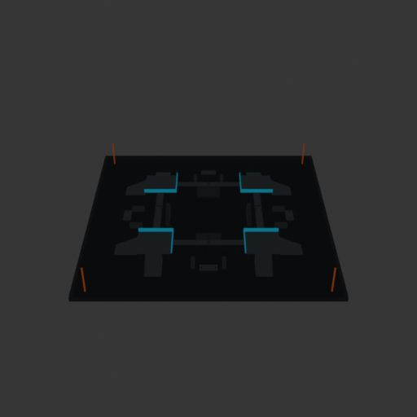
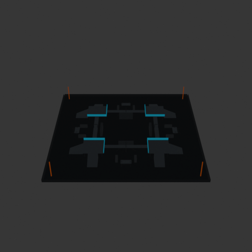
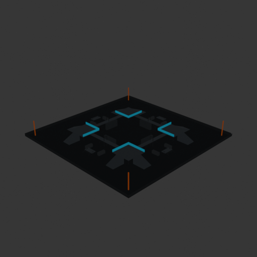
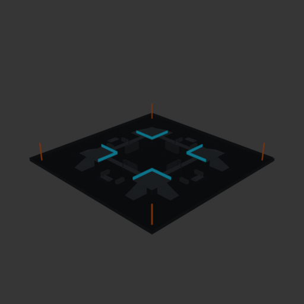
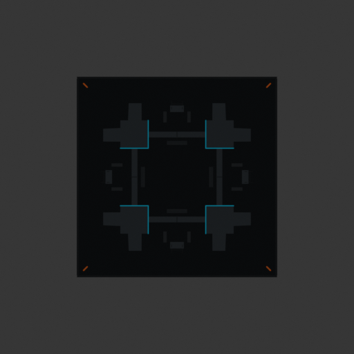

# Asset Forge review: competitive_tag_arena_50x50 / bc9014439b5a4221ba7cfb5e9c624383

This directory is an immutable, sanitized visual-review bundle generated from a VM Blender job.
It contains no credentials, write endpoints, logs, source archives, or private object-store URLs.

- Job: `bc9014439b5a4221ba7cfb5e9c624383`
- Parent job: `0d8e52b07b8a4a308ceb5dd68ac496f5`
- Source commit: `a8b8b00cafc51c22cf56a2b604439a3937d7a174`
- Blender: `5.1.2`
- Source manifest SHA-256: `72755c26d561e717fda971e00de3958a6aa06ebc7283d8608bb56e7d5184297a`
- Canonical Forge page: https://forge.eventinel.com/jobs/bc9014439b5a4221ba7cfb5e9c624383

## Render gallery

### front

### left

### perspective_front_left

### perspective_front_right

### perspective_rear

### rear

### right

### top

