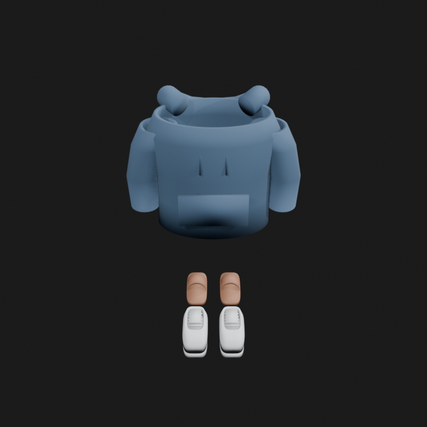
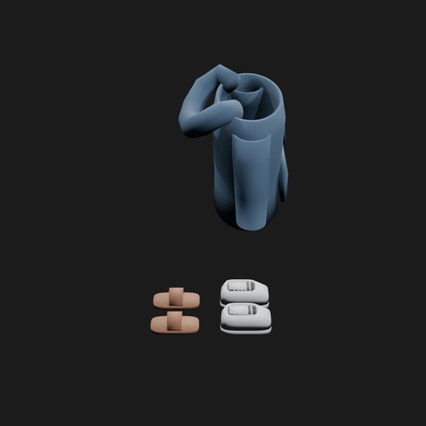
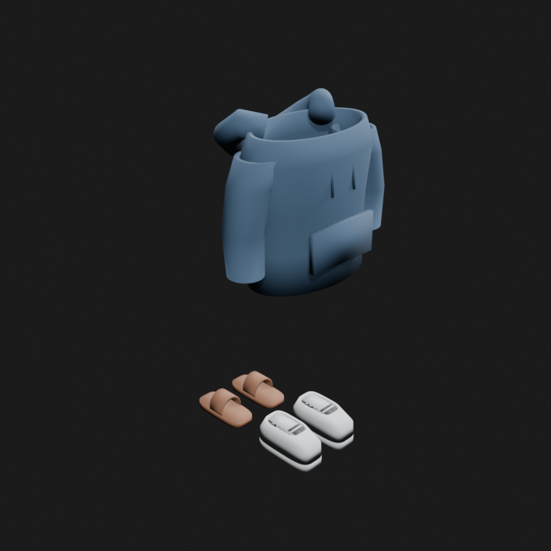
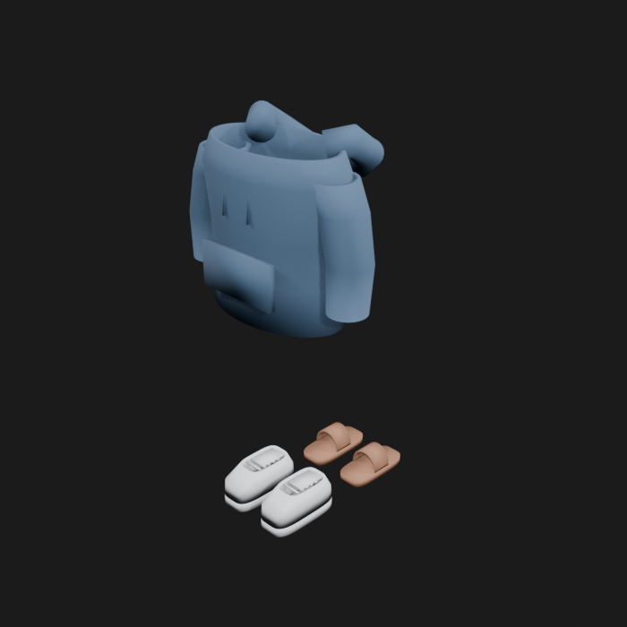
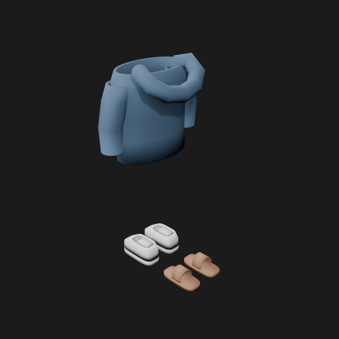
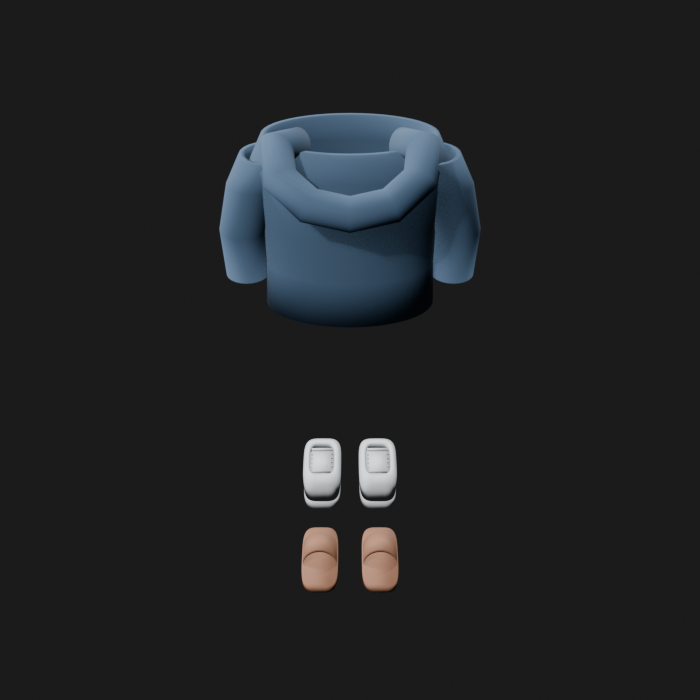
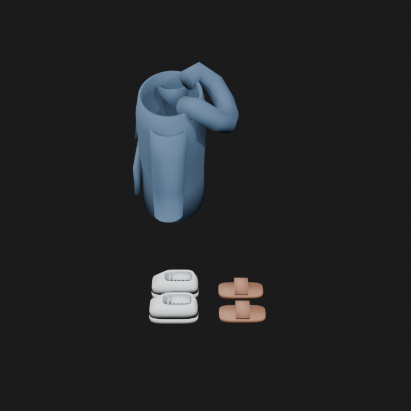
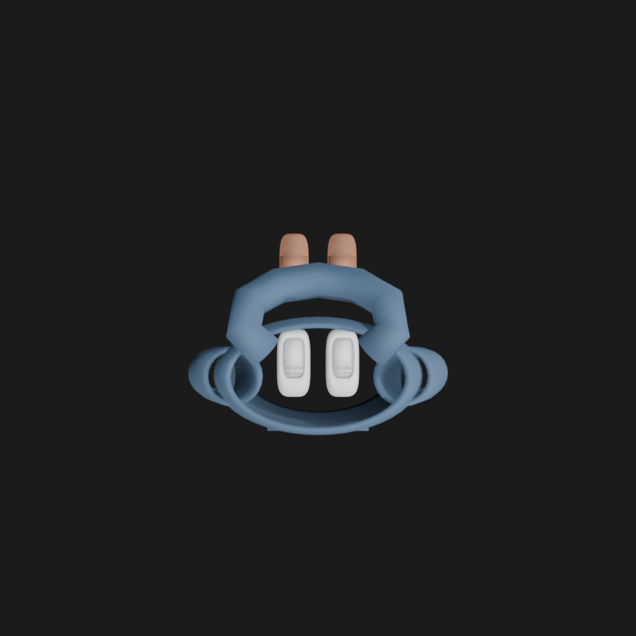

# Asset Forge review: kellan_metahuman_clothing_set / c4efb59cb28a4e0091a5a0a48d22e15b

This directory is an immutable, sanitized visual-review bundle generated from a VM Blender job.
It contains no credentials, write endpoints, logs, source archives, or private object-store URLs.

- Job: `c4efb59cb28a4e0091a5a0a48d22e15b`
- Parent job: `f70067a8408340e9af66ac51c6bc7423`
- Source commit: `6a059f9a7e41bd3802951344745bbb8c7e22d7dc`
- Blender: `5.1.2`
- Source manifest SHA-256: `74a13927966d46e0d6bb5429514dcb7295f77d3bf8bca929b979c3127810bda1`
- Canonical Forge page: https://forge.eventinel.com/jobs/c4efb59cb28a4e0091a5a0a48d22e15b

## Render gallery

### front

### left

### perspective_front_left

### perspective_front_right

### perspective_rear

### rear

### right

### top

