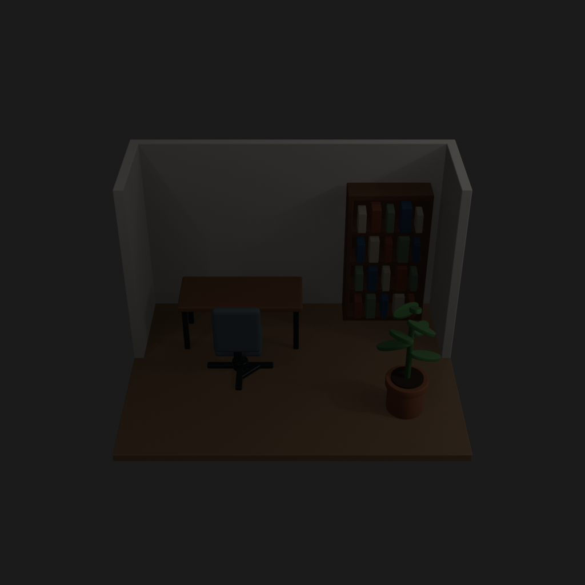
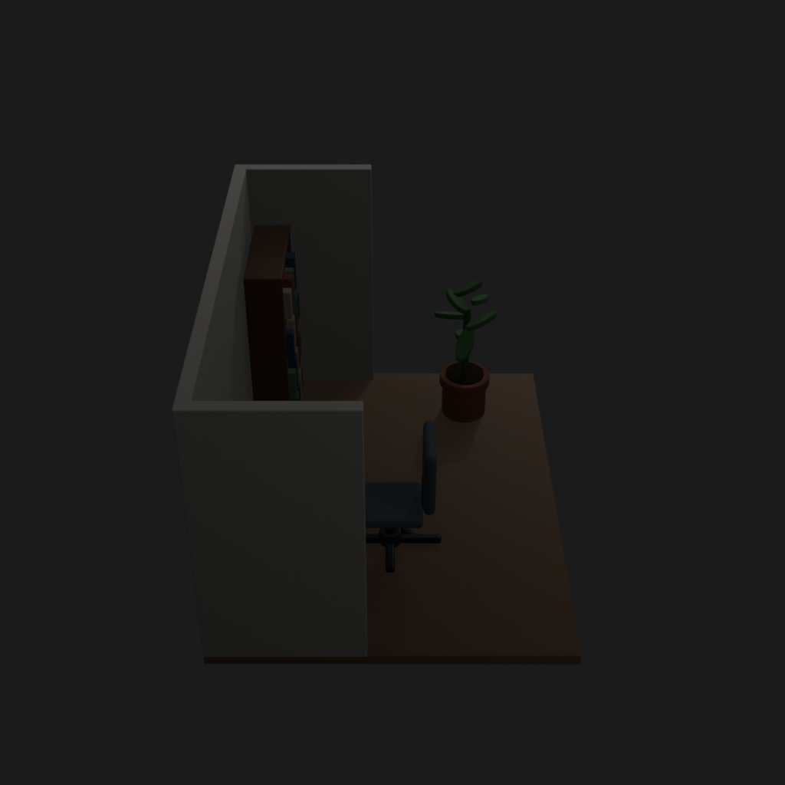
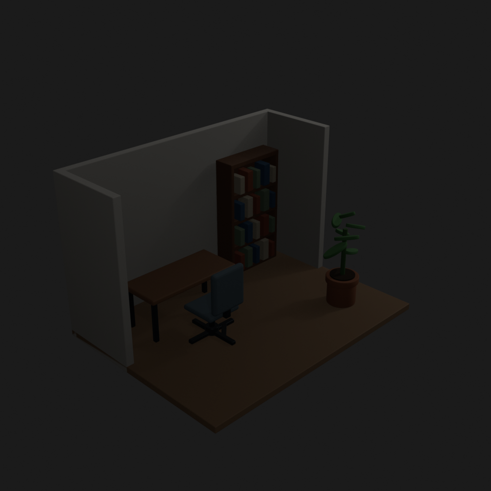
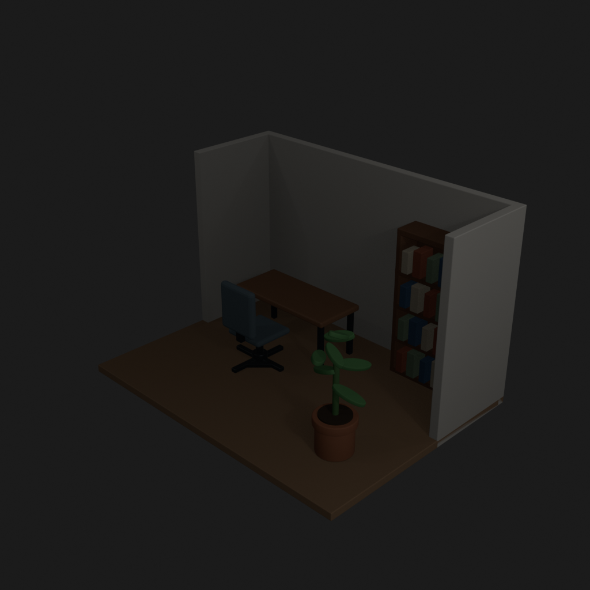
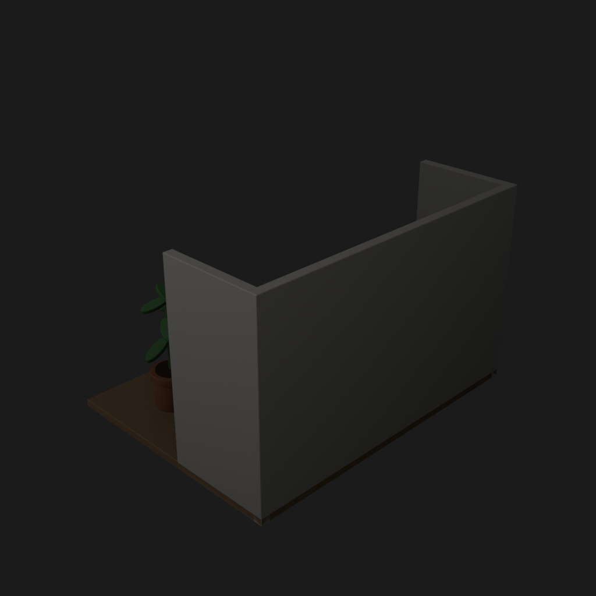
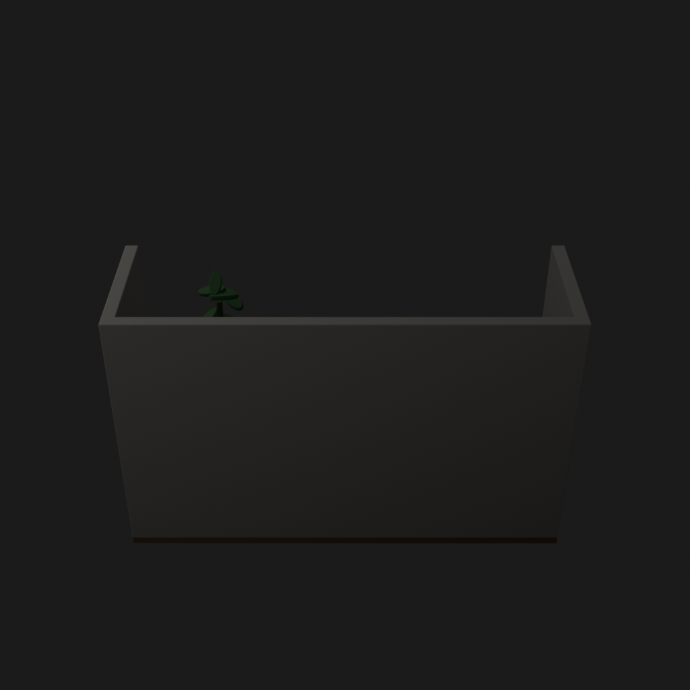
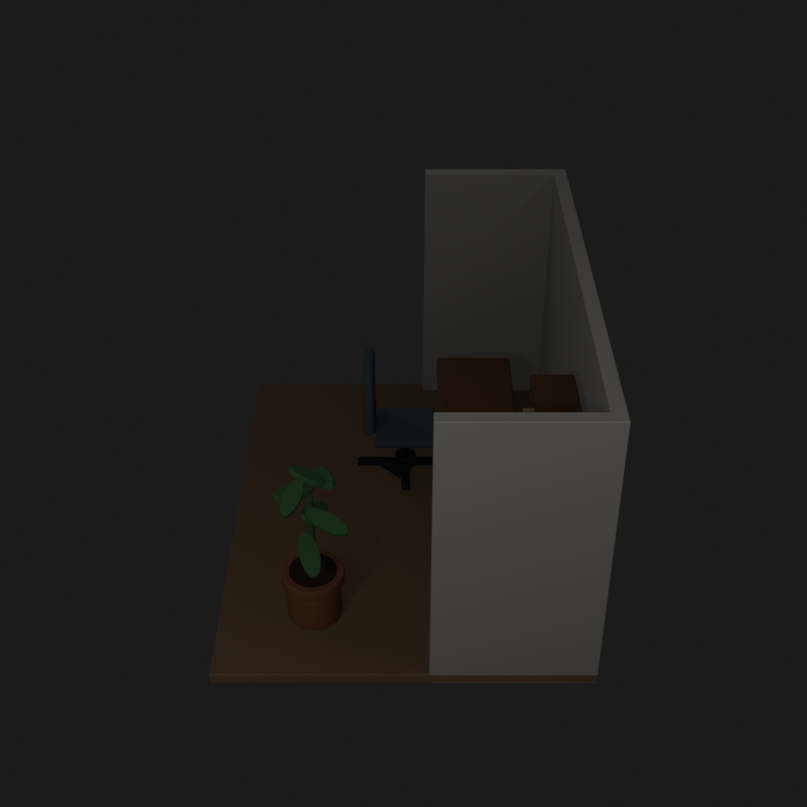
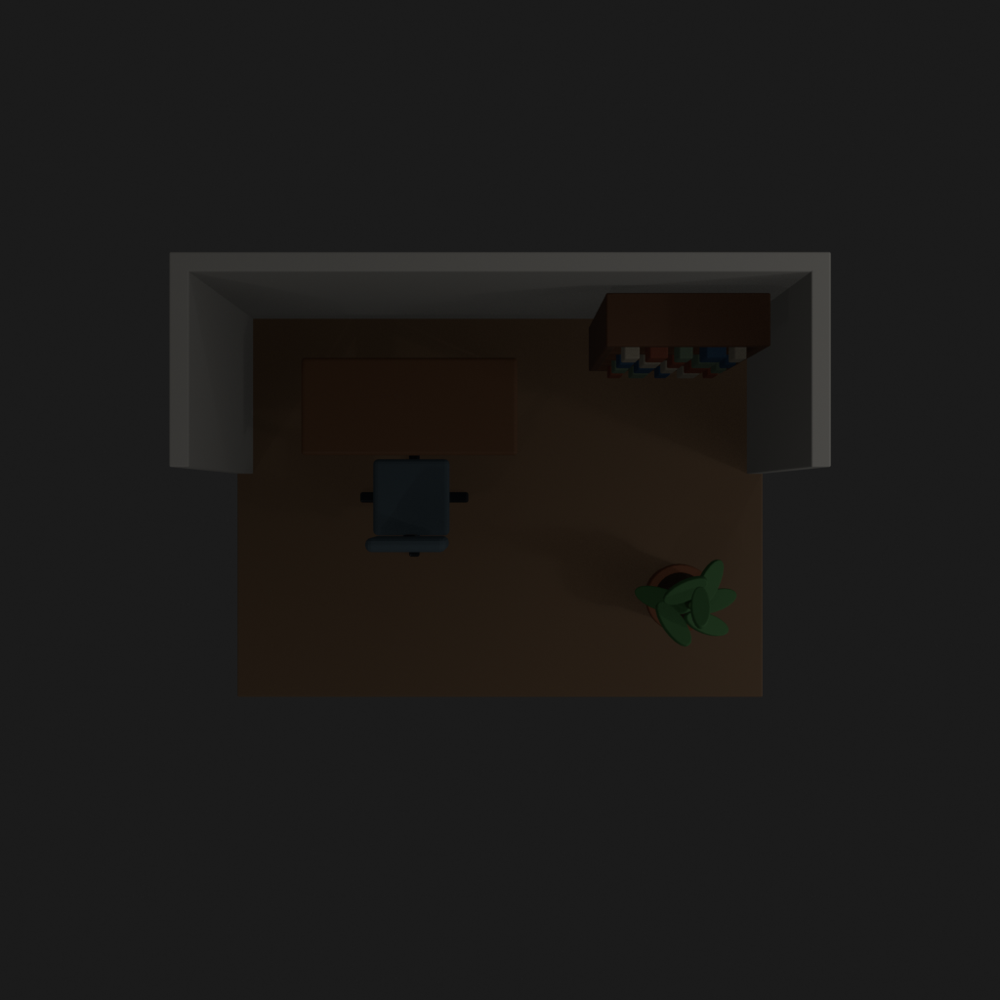

# Asset Forge review: small_office_trial_20260905 / ccb48423443d51e792a4060427baca69

This directory is an immutable, sanitized visual-review bundle generated from a Blender worker job.
It contains no credentials, write endpoints, logs, source archives, or private object-store URLs.

- Job: `ccb48423443d51e792a4060427baca69`
- Parent job: `none`
- Source commit: `6b5372cc76831d578685bb54e3fa0068fa8b0574`
- Blender: `5.1.2`
- Source manifest SHA-256: `57bd4ef6d708d0e7c2fdfe9636bf7a909f518760cf9498d9dba56064a482efa1`
- Canonical Forge page: https://forge.eventinel.com/jobs/ccb48423443d51e792a4060427baca69

## Render gallery

### front

### left

### perspective_front_left

### perspective_front_right

### perspective_rear

### rear

### right

### top

