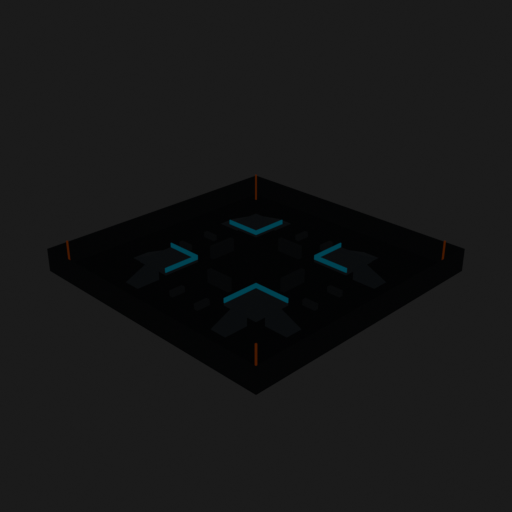
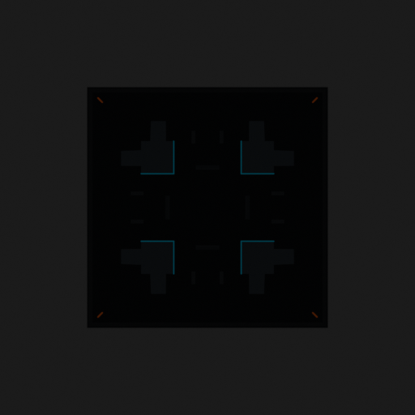

# Asset Forge review: competitive_tag_arena_50x50 / d086649a727246559e5812b197f5bba6

This directory is an immutable, sanitized visual-review bundle generated from a VM Blender job.
It contains no credentials, write endpoints, logs, source archives, or private object-store URLs.

- Job: `d086649a727246559e5812b197f5bba6`
- Parent job: `b1de79b407f64b6380aba6d1abb2ab2f`
- Source commit: `8de5f5d4c000087fd4776bacc721b405c5187995`
- Blender: `5.1.2`
- Source manifest SHA-256: `b8676c7bbe41b3b54d2dae727d4a6043b3456051ed58ed5cf9dad54807983a2b`
- Canonical Forge page: https://forge.eventinel.com/jobs/d086649a727246559e5812b197f5bba6

## Render gallery

### front

### left

### perspective_front_left

### perspective_front_right

### perspective_rear

### rear

### right

### top

