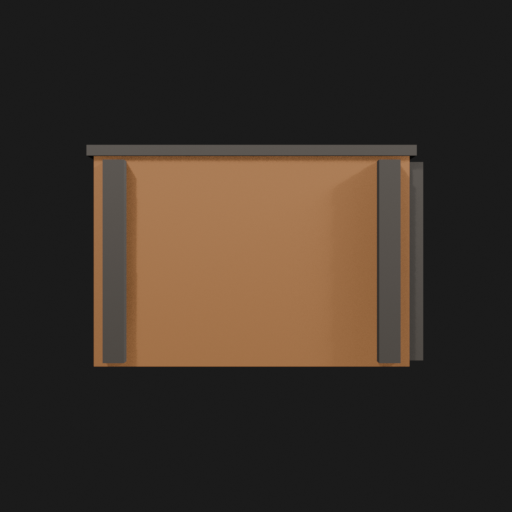
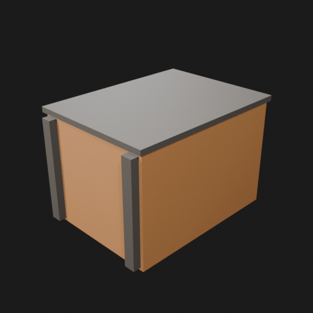
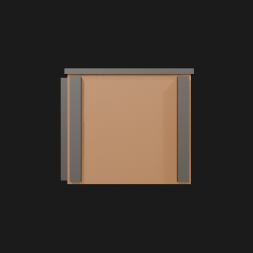
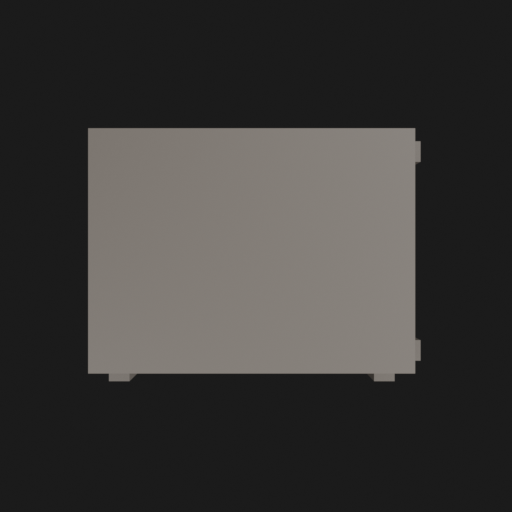

# Asset Forge review: test_crate / d3af4244021a4eff939ef205fa1eeaa4

This directory is an immutable, sanitized visual-review bundle generated from a VM Blender job.
It contains no credentials, write endpoints, logs, source archives, or private object-store URLs.

- Job: `d3af4244021a4eff939ef205fa1eeaa4`
- Parent job: `2698d389947145e8a775f5385ac66683`
- Source commit: `5ee6a053b05e5d7c343d928027f70dd012cf7232`
- Blender: `5.1.2`
- Source manifest SHA-256: `a0046fbe5435f4a6b7eb71b7fdab7ac3472c305bc4c61dc8d0d377e3233a297b`
- Canonical Forge page: https://forge.eventinel.com/jobs/d3af4244021a4eff939ef205fa1eeaa4

## Render gallery

### front

### left

### perspective_front_left

### perspective_front_right

### perspective_rear

### rear

### right

### top

