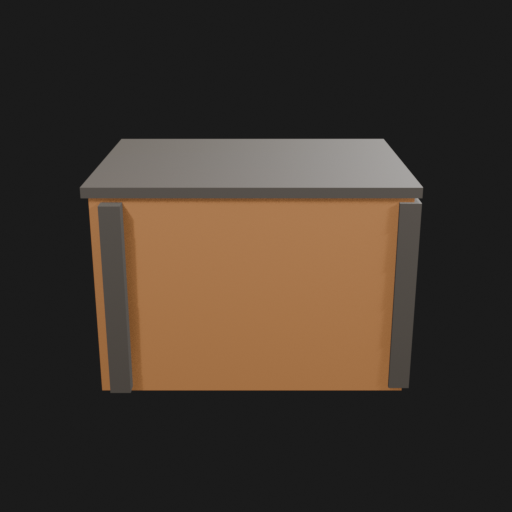
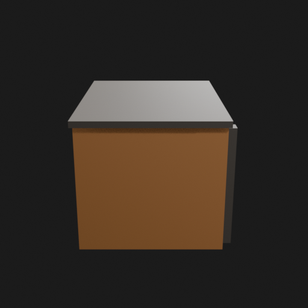
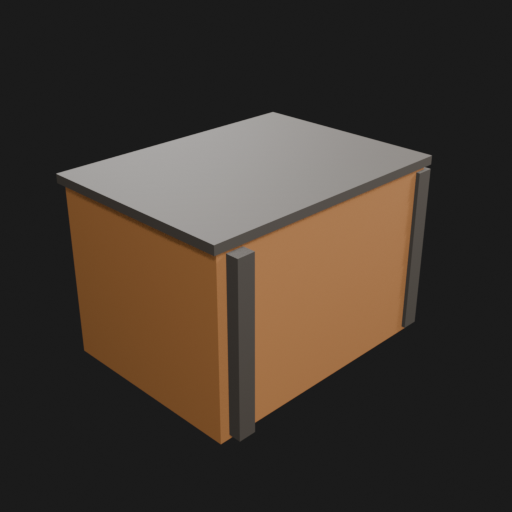
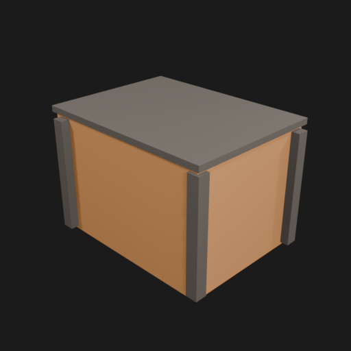
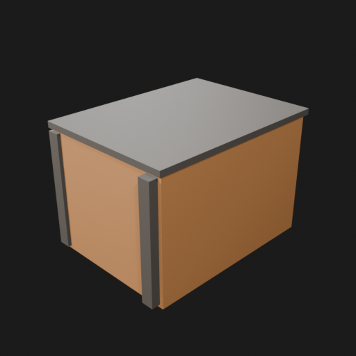
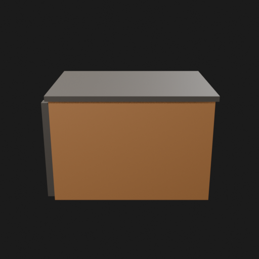
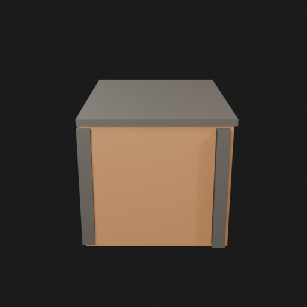

# Asset Forge review: test_crate / ec27a545667f42daa7d5395cfb5e4a0b

This directory is an immutable, sanitized visual-review bundle generated from a VM Blender job.
It contains no credentials, write endpoints, logs, source archives, or private object-store URLs.

- Job: `ec27a545667f42daa7d5395cfb5e4a0b`
- Parent job: `238389120b0a40c68a52438e7bc4ffd9`
- Source commit: `791ccc38dc33dc60488782171fe46661d418c343`
- Blender: `5.1.2`
- Source manifest SHA-256: `daf6c3b072cf31c9d4559b8ce85a45026fb48e9b2623947f3a68a83114c5fa8d`
- Canonical Forge page: https://forge.eventinel.com/jobs/ec27a545667f42daa7d5395cfb5e4a0b

## Render gallery

### front

### left

### perspective_front_left

### perspective_front_right

### perspective_rear

### rear

### right

### top

