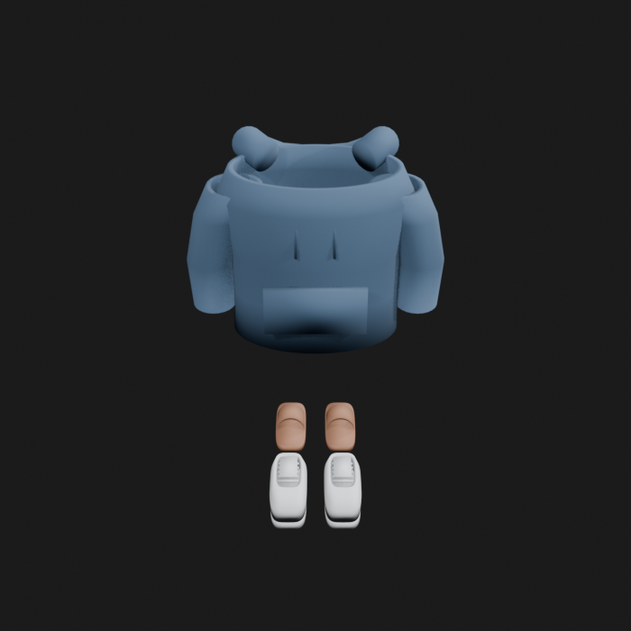
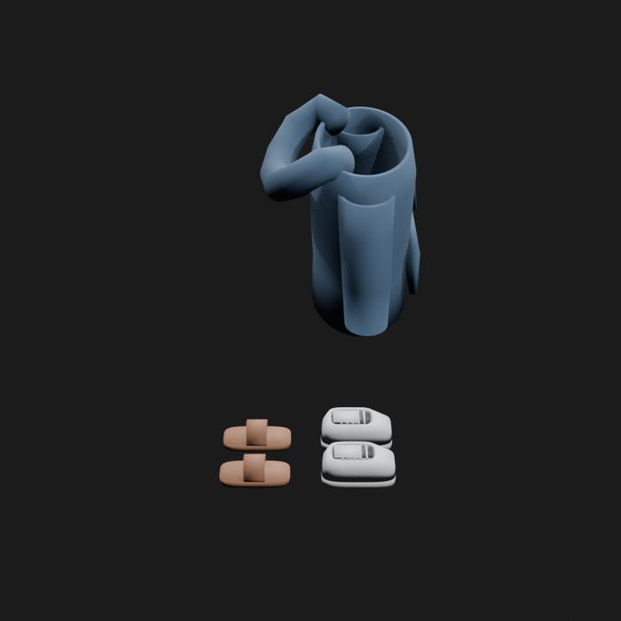
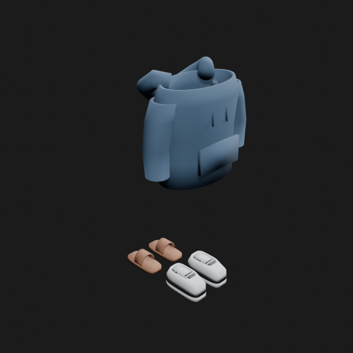
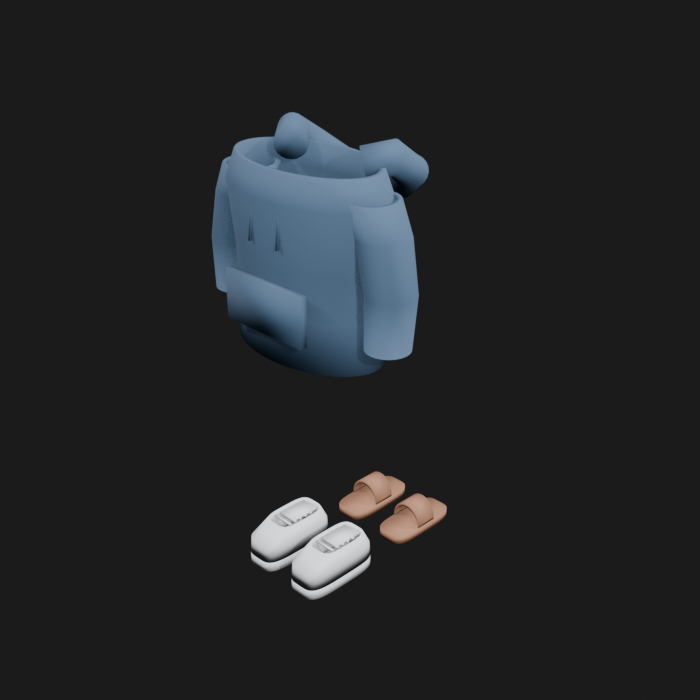
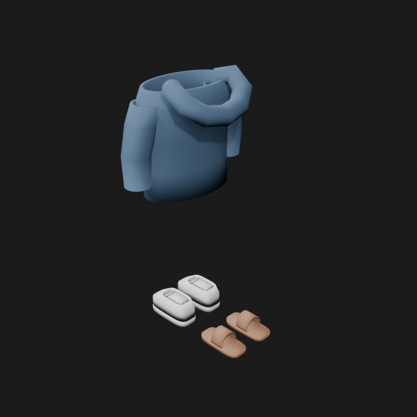
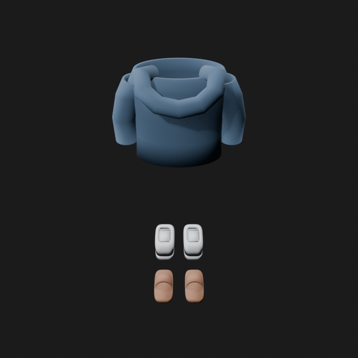
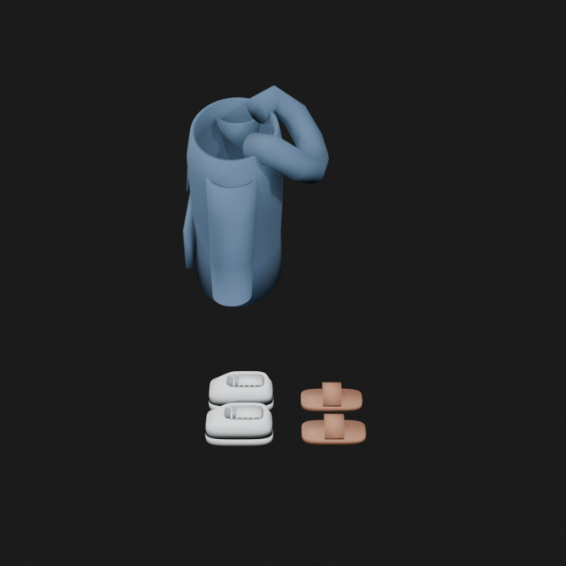

# Asset Forge review: kellan_metahuman_clothing_set / f70067a8408340e9af66ac51c6bc7423

This directory is an immutable, sanitized visual-review bundle generated from a VM Blender job.
It contains no credentials, write endpoints, logs, source archives, or private object-store URLs.

- Job: `f70067a8408340e9af66ac51c6bc7423`
- Parent job: `none`
- Source commit: `52202f31075c37fa35ac063e9cefcb531677e741`
- Blender: `5.1.2`
- Source manifest SHA-256: `ffe58c8f42348499fdb096e15dbb52822b1a3f93cf9ba8d2343b79d7d6a26bdd`
- Canonical Forge page: https://forge.eventinel.com/jobs/f70067a8408340e9af66ac51c6bc7423

## Render gallery

### front

### left

### perspective_front_left

### perspective_front_right

### perspective_rear

### rear

### right

### top

