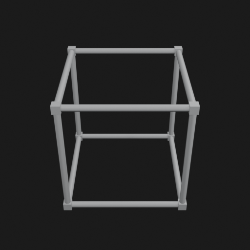
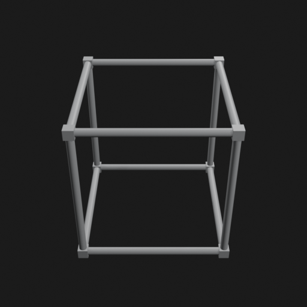
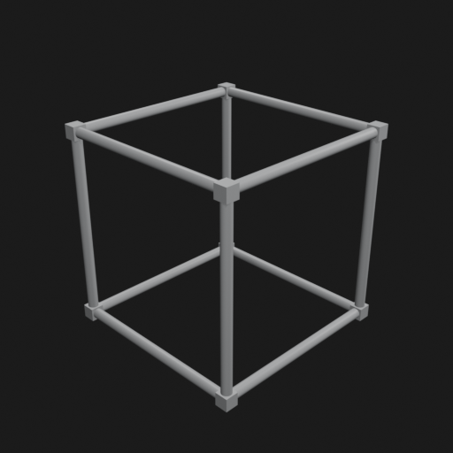
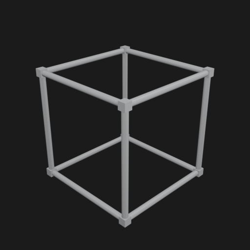
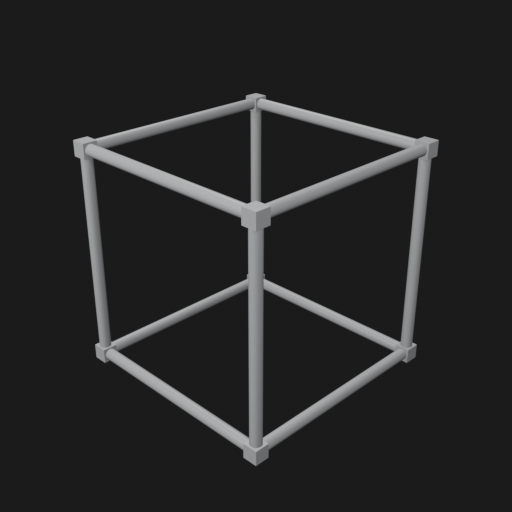
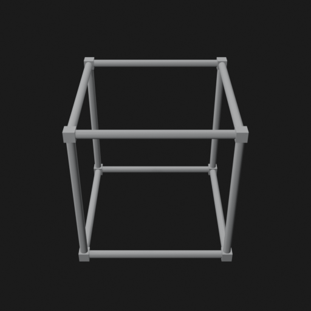
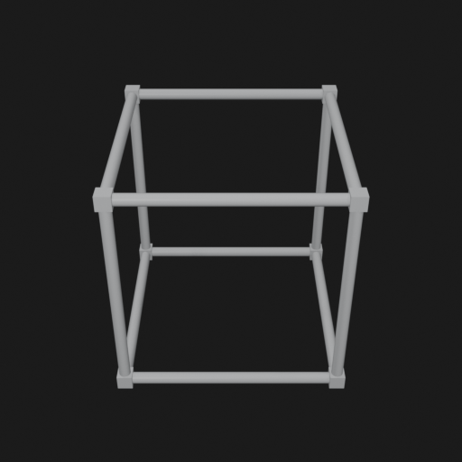
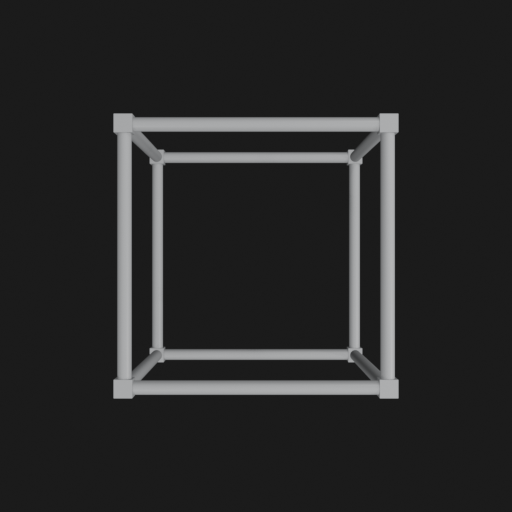

# Asset Forge review: pvc_cube_frame / ffedf4444d3d487a96aa2e0f74d46c2a

This directory is an immutable, sanitized visual-review bundle generated from a VM Blender job.
It contains no credentials, write endpoints, logs, source archives, or private object-store URLs.

- Job: `ffedf4444d3d487a96aa2e0f74d46c2a`
- Parent job: `none`
- Source commit: `5922d912eb817c949c8ecefd7b25dbc58c756400`
- Blender: `5.1.2`
- Source manifest SHA-256: `d462eac6b0d02aea118597e366a74b397d8e24a8923a27f835242a89ae7acd13`
- Canonical Forge page: https://forge.eventinel.com/jobs/ffedf4444d3d487a96aa2e0f74d46c2a

## Render gallery

### front

### left

### perspective_front_left

### perspective_front_right

### perspective_rear

### rear

### right

### top

